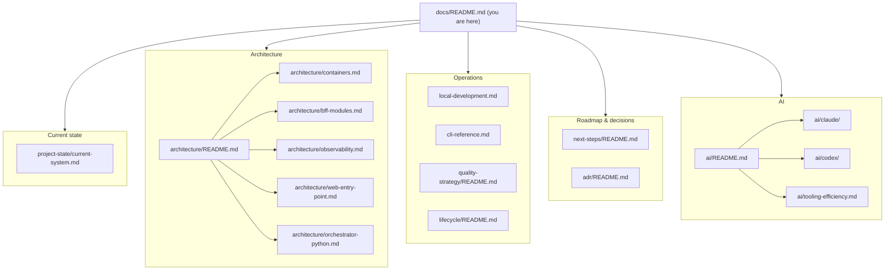

# Documentation Hub

Single entry point for the mini-commerce engineering playground. Each fact
lives in **one** spoke; this hub points to them.

- Governance frame (conceptual / scope authority): [ai/codex/governance.md](ai/codex/governance.md)
- Execution frame (Claude Code, IDE assistants): [ai/README.md](ai/README.md)
- Root walkthrough (10-minute run): [`../README.md`](../README.md)

## Read this if…

| You are… | Start here |
|---|---|
| A new contributor running the stack for the first time | [`../README.md`](../README.md) → [local-development.md](local-development.md) |
| Looking up a CLI command | [cli-reference.md](cli-reference.md) |
| Trying to understand what the system does today | [project-state/current-system.md](project-state/current-system.md) |
| Designing a code change | [architecture/](architecture/) (pick the spoke for your area) |
| Running a Claude Code session | [ai/claude/playbook.md](ai/claude/playbook.md) |
| Running a Codex session for scope / direction | [ai/codex/governance.md](ai/codex/governance.md) |
| Auditing AI usage / picking the right assistant | [ai/README.md](ai/README.md) |
| Reviewing what just shipped | [next-steps/README.md](next-steps/README.md) |

## Doc tree

## Spoke index

| Spoke | What it owns |
|---|---|
| [project-state/current-system.md](project-state/current-system.md) | Authoritative feature + UX snapshot |
| [project-state/frontend-wiring-status.md](project-state/frontend-wiring-status.md) | Backend surface + frontend wiring constraints |
| [architecture/containers.md](architecture/containers.md) | C4 L2 — container map across Compose profiles (the **stack inventory** lives here) |
| [architecture/bff-modules.md](architecture/bff-modules.md) | C4 L3 — BFF module pattern, invariants, domain events |
| [architecture/observability.md](architecture/observability.md) | OTel pipeline (BFF → collector → Tempo + Prometheus + Grafana) |
| [architecture/web-entry-point.md](architecture/web-entry-point.md) | Browser → web → BFF/visualizer proxy topology |
| [architecture/orchestrator-python.md](architecture/orchestrator-python.md) | `./dev` → `python -m pg` → `docker compose` dispatch + `pg hack` |
| [local-development.md](local-development.md) | Host-mode workflow + troubleshooting |
| [cli-reference.md](cli-reference.md) | The **command matrix** lives here (`./dev`, `pnpm pg:*`, `task`) |
| [quality-strategy/README.md](quality-strategy/README.md) | Test pyramid, ownership, CI quality gates |
| [lifecycle/README.md](lifecycle/README.md) | SDLC, branching, PR conventions |
| [next-steps/README.md](next-steps/README.md) | Open threads + completed iterations |
| [adr/README.md](adr/README.md) | Architecture Decision Records — *why* we got here |
| [uat/walkthrough-uat.md](uat/walkthrough-uat.md) | Manual acceptance walkthrough |
| [visualizer/art-direction.md](visualizer/art-direction.md) | PS1 art rules for the 3D visualizer |
| [ai/README.md](ai/README.md) | Assistant roster + "which AI for which job" decision tree |
| [ai/claude/playbook.md](ai/claude/playbook.md) | Claude Code execution rules |
| [ai/codex/governance.md](ai/codex/governance.md) | Conceptual / scope authority |
| [ai/tooling-efficiency.md](ai/tooling-efficiency.md) | Subagent picks, parallel calls, cache pacing, memory rules |

## Authoring rules

- All durable content is in English.
- No real company, product, service names, URLs, IPs, or credentials.
- No AI attribution, generated-by text, or co-author trailers.
- **Hub-and-spoke**: each fact has one canonical home. Indexes (READMEs) may
  summarize; they never restate.
- Diagrams are Mermaid in-source — no PNGs.
- "Current state" docs (`project-state/`, `architecture/`) describe what *is*;
  ADRs describe *why*. When a decision changes, update both.
