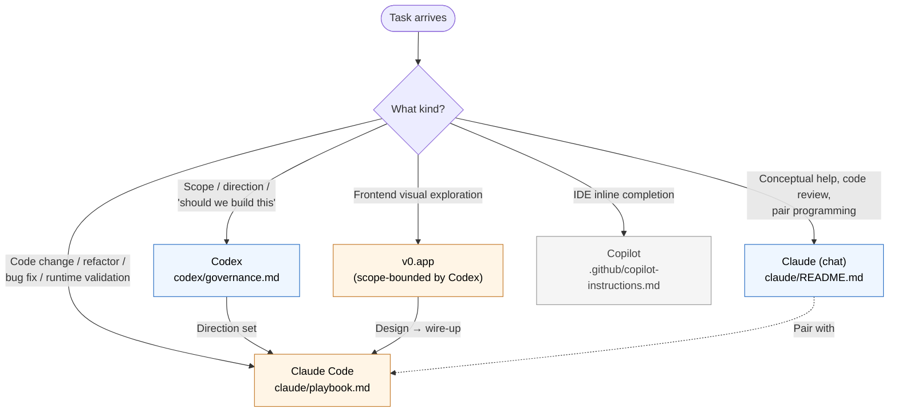

# AI Governance Hub

> Single entry point for any AI assistant working on this repo. Each
> assistant has a **lane**; this file tells you which lane your task belongs
> in and where its rules live.

## Assistant roster

| Assistant | Scope | Lane | Loaded by |
|---|---|---|---|
| **Claude Code** (CLI / API tool-use) | Implementation, runtime validation, repo edits | [`claude/playbook.md`](claude/playbook.md) | `CLAUDE.md` (root) |
| **Claude** (chat / pairing) | Review, prompt design, exploration | [`claude/README.md`](claude/README.md) | manual paste |
| **Codex** (chatgpt.com / CLI) | Conceptual design, scope framing, governance review | [`codex/governance.md`](codex/governance.md) | repo-local skill or paste |
| **GitHub Copilot** (IDE inline) | Tab-complete suggestions during editing | [`../../.github/copilot-instructions.md`](../../.github/copilot-instructions.md) (pointer only) | IDE auto-load |
| **v0.app** | Frontend visual direction & design exploration | governed by Codex frame | manual |
| **Vercel Agent / others** | Out of scope unless owner opts in | n/a | n/a |

## Which AI for which job

## Shared rules across all assistants

1. **No AI attribution** in committed content (commit messages, PRs, docs).
2. **English** for committed content; conversation may happen in Spanish.
3. **No real names**, URLs, IPs, or credentials — domain is fictional.
4. **Repository owner is the only final authority** on direction, merges,
   acceptance.

Full statement: [`codex/governance.md`](codex/governance.md) §Authority.

## Tooling efficiency

[`tooling-efficiency.md`](tooling-efficiency.md) — subagent choice, parallel
tool calls, `/loop` cadence, memory rules. Tuned for usage-billed sessions;
applies to any tool-using LLM in this repo.

## Related

- Documentation hub: [`../README.md`](../README.md)
- Claude lane: [`claude/`](claude/)
- Codex lane: [`codex/`](codex/)
- Architecture spokes (the substrate every assistant should link to instead of
  duplicating): [`../architecture/`](../architecture/)
