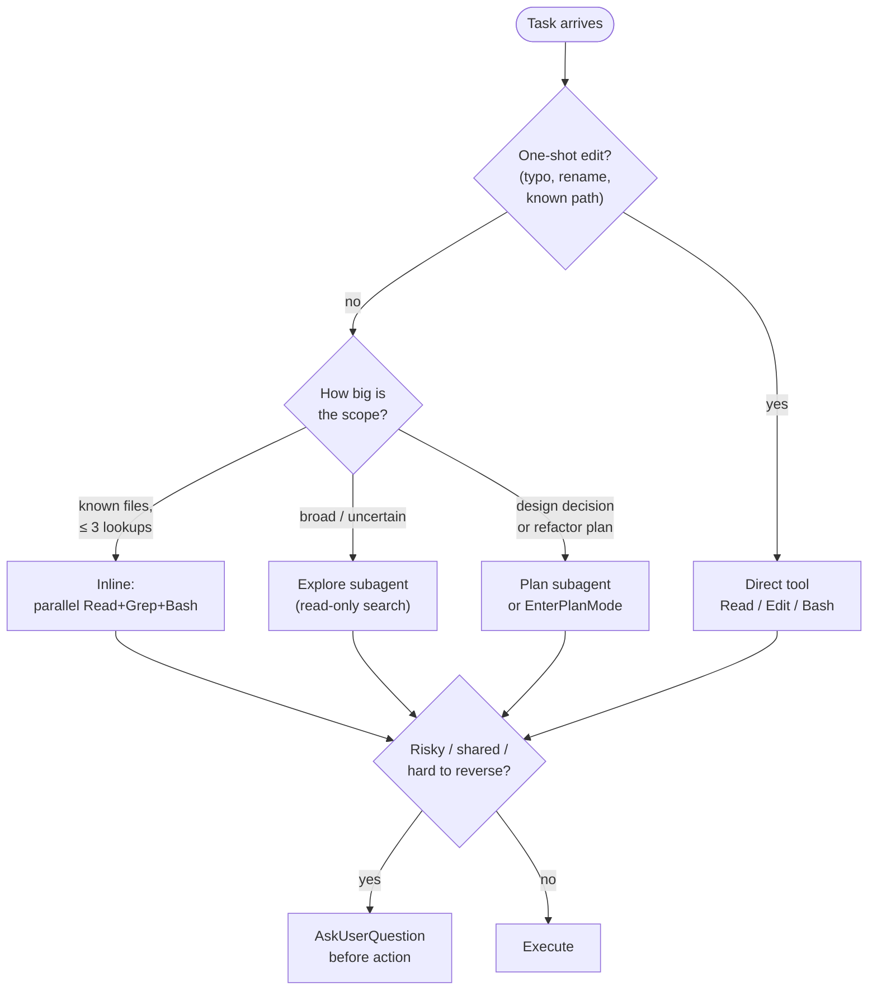

# AI Tooling Efficiency

> Concrete patterns for using Claude Code (and any tool-using LLM) on this
> repo without burning context, cache, or money. Tuned for **usage-billed**
> sessions.

## Cheat sheet

## Subagent picks

| Situation | Use | Don't use |
|---|---|---|
| Find one symbol / file with a known name | `Bash` (`grep`/`find`) | `Explore` |
| Survey unknown code with ≥ 3 queries | `Explore` | `general-purpose` |
| Design before edit (multi-file refactor) | `EnterPlanMode` → `Plan` | `general-purpose` |
| Independent multi-step research with web | `general-purpose` | `Explore` |
| One-shot edit on a known file | None — direct `Edit` | Any subagent |

**Default = no subagent.** Spawning starts cold and re-derives context; only
delegate when the parent context would otherwise blow up or the work is
genuinely parallel.

## Parallel tool calls (cheap wins)

Run independent reads/greps/bash **in one message**, not sequentially.
Examples:

- Read 3 files at once → one message, three `Read` calls.
- `git status` + `git diff` + `git log` → one message, three `Bash` calls.
- `grep` for two unrelated symbols → one message, two `Bash` calls.

Sequential is correct only when call N's output decides call N+1's arguments.

## Prompt-cache pacing (`/loop`)

Anthropic's prompt cache TTL is **5 min**. Pacing rules:

| Interval | When |
|---|---|
| **60–270 s** | Active poll of external state you must check often (CI, queue). Cache stays warm. |
| **300 s** | **Avoid.** Worst-of-both — cache miss without amortizing it. |
| **1200–1800 s** | Idle tick. One cache miss buys a long quiet stretch. |

Don't think "minutes" — think "cache windows."

## Memory writes (`MEMORY.md`)

| Type | When | When NOT |
|---|---|---|
| `user` | User role, preferences, knowledge level | Anything derivable from prompt |
| `feedback` | Owner corrected or confirmed an approach (with **Why**) | One-off polish |
| `project` | Owner / org / dates — converted to absolute dates | Code structure (use git) |
| `reference` | External system pointers (Linear board, Slack channel, dashboard URL) | Anything in-repo |

Never save: code patterns, file paths, architecture, recent commits, fix
recipes. All derivable.

## Confirmation gates (always ask first)

- `git push --force`, `git reset --hard`, `rm -rf`, dropping volumes
- Destructive `docker compose down -v`
- Anything outside the local repo (PR comments, Slack, deploys)
- Uploading sensitive content to third-party renderers / pastebins

## Repo-specific tips

- This repo runs an **auto-memory hook** under
  `~/.claude/projects/-Users-nicolaspizarro-repo-expresso-engineering-playground/memory/`.
  Read `MEMORY.md` before starting a non-trivial task.
- `./dev` is the bash trampoline; the real CLI is `python -m pg`. See
  [`../architecture/orchestrator-python.md`](../architecture/orchestrator-python.md).
- After a substantive change, validation chain is:
  `pnpm typecheck` → `pnpm test` → `./dev smoke`. Lint+format gate CI; run
  `pnpm lint` and `pnpm format` before pushing.

## Related

- AI roster + which-AI-for-which-job: [`README.md`](README.md)
- Claude lane: [`claude/playbook.md`](claude/playbook.md)
- Codex lane: [`codex/governance.md`](codex/governance.md)
