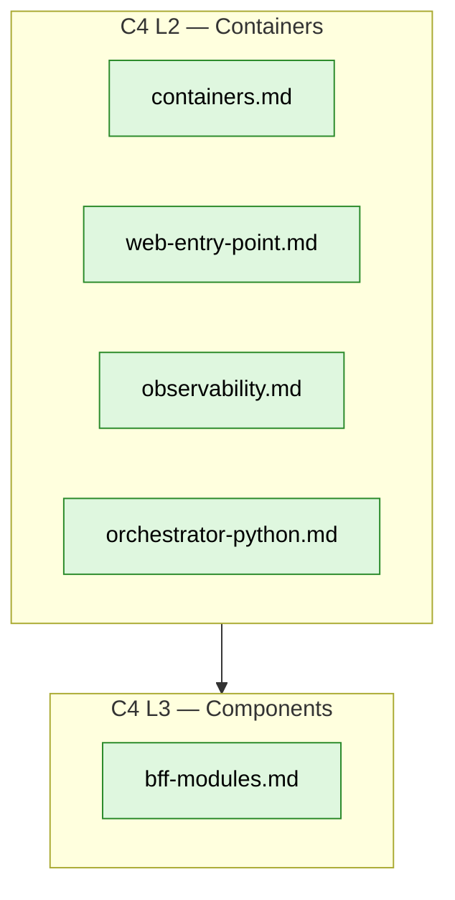

# Architecture

> Current-state architecture of the mini-commerce engineering playground.
> Keep documentation **just ahead** of the code, not behind it.

## C4 map

## Current spokes

| Doc | View |
|---|---|
| [`containers.md`](containers.md) | C4 L2 — container map across all Compose profiles |
| [`web-entry-point.md`](web-entry-point.md) | Browser → web → BFF/visualizer proxy topology |
| [`bff-modules.md`](bff-modules.md) | C4 L3 — BFF module graph + invariants |
| [`observability.md`](observability.md) | OTel SDK → collector → Tempo + Prometheus + Grafana |
| [`orchestrator-python.md`](orchestrator-python.md) | Local orchestrator — `./dev` → `python -m pg` → `docker compose` |

## Planned

- `context.md` — C4 L1 system context (actors).
- `data-model.md` — domain entities and relationships.
- `events.md` — domain events crossing module boundaries.
- `security.md` — trust boundaries, auth model (fictional).

## Authoring rules

- No real company, product, or service names. No real URLs, IPs, or
  credentials.
- Diagrams are Mermaid, authored inline in the markdown — keep the source
  diff-able.
- Each spoke owns its facts once. Other docs link instead of restating.

## Relationship to ADRs

This folder describes **the current state**. ADRs in
[`../adr/`](../adr/README.md) describe **why we got here**. If a decision is
reversed, both must be updated.
