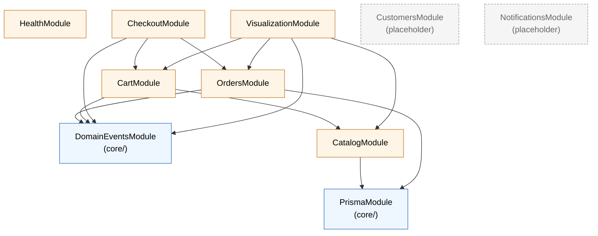

# BFF Modules — C4 Level 3

> Current-state component view of the NestJS BFF (`apps/bff/`). The canonical
> home of the **module pattern** and **inter-module dependency rules**. Other
> docs (CLAUDE.md, copilot, AI playbooks) link here instead of restating them.

## Module graph

Edges point from consumer → provider. **All edges are `imports: [Module]`
declarations**; no module reaches into another's internal files.

## Module file pattern

Every domain module lives in `apps/bff/src/modules/<domain>/` with **four
files, no more**:

| File | Role |
|---|---|
| `<domain>.module.ts` | `@Module` — `providers`, `imports`, `exports` only |
| `<domain>.service.ts` | Business logic — `@Injectable` |
| `<domain>.controller.ts` | HTTP routes — `@Controller` |
| `<domain>.types.ts` | DTOs / wire-format types (consumed by `@mini-commerce/contracts` when they cross the wire) |

Tests sit beside source as `*.spec.ts`.

## Dependency rules (load-bearing)

1. **Cross-module access is through the barrel only.** Never
   `import { OrdersService } from '../orders/orders.service'`. If you need it,
   the providing module must `exports: [OrdersService]` and the consumer must
   `imports: [OrdersModule]`.
2. **`DomainEventsModule` is not `@Global()`.** Modules that publish or
   subscribe declare it explicitly. This keeps test isolation clean —
   `Test.createTestingModule` builds the minimum graph.
3. **Placeholder modules stay empty.** `CustomersModule` and
   `NotificationsModule` exist so future ADRs can claim the namespace, but they
   must not gain transitive dependencies until the matching domain ships.

## Cross-cutting concerns

Applied globally in `apps/bff/src/main.ts`:

| Concern | Mechanism |
|---|---|
| Request logging | `LoggingInterceptor` |
| Error normalization | `HttpExceptionFilter` |
| DTO validation | `ValidationPipe` (`class-validator`) |
| Telemetry | `initTelemetry()` — OTLP HTTP exporter when `OTEL_EXPORTER_OTLP_ENDPOINT` is set |

See [`observability.md`](observability.md) for the trace pipeline downstream
of `initTelemetry`.

## Data-model invariants

- **Money** is always `{ amountMinor: number, currency: string }` — integer
  cents, never floats.
- **Branded types** live in `@mini-commerce/shared-types`: `ProductId`,
  `CartItemId`, `OrderId`, `CustomerId`. Use them; don't substitute plain
  `string`.
- **Cart** is single-user, in-process, resets on BFF restart. Intentional for
  Phase 1.

## Visualization endpoint as a Phase-3 boundary

`GET /visualization-data` is a read-only aggregator: `VisualizationService`
pulls from `CatalogService`, `CartService`, `OrdersService`, and reshapes
into `VisualizationItem[]`. The `visualizer-3d` frontend **never reads the
database directly** — all data flows through this endpoint. This boundary is
load-bearing for the Phase-3 service extraction.

## Related

- Web entry point + proxy: [`web-entry-point.md`](web-entry-point.md)
- Container view: [`containers.md`](containers.md)
- Observability pipeline: [`observability.md`](observability.md)
- Current-state feature inventory: [`../project-state/current-system.md`](../project-state/current-system.md)
