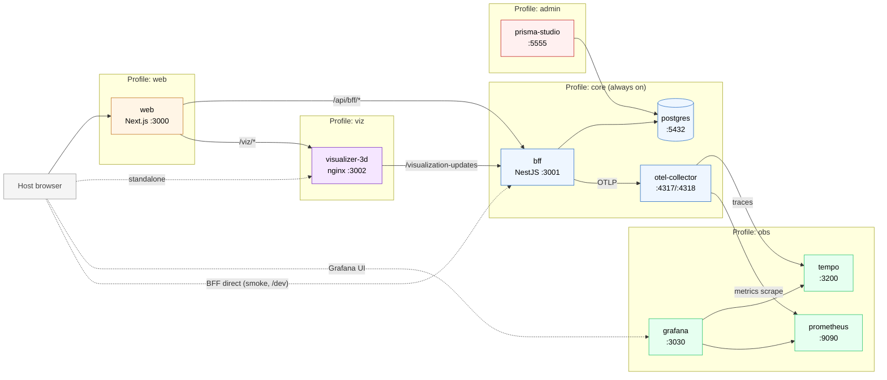

# Containers — C4 Level 2

> Current-state container view across all Docker Compose profiles. **Canonical
> home of the stack inventory** — other docs link here instead of restating
> the table.

## Container map

## Profiles

| Profile | Brings up | Activated by |
|---|---|---|
| `core` (always) | `postgres`, `bff`, `otel-collector` | `./dev up` |
| `web` | + `web` | `./dev up web` |
| `viz` | + `visualizer-3d` | `./dev up viz` |
| `admin` | + `prisma-studio` | `./dev up admin` |
| `obs` | + `tempo`, `prometheus`, `grafana` | `./dev up obs` |
| `full` | all of the above | `./dev up full` |

`--fresh` on any target drops the Postgres volume and re-migrates + re-seeds.

## Service inventory

| Service | Tech | Default URL | Role |
|---|---|---|---|
| `web` | Next.js 14 standalone | http://localhost:3000 | Product shell + browser entry point |
| `bff` | NestJS | http://localhost:3001 | Domain API |
| `visualizer-3d` | nginx + vanilla Three.js | http://localhost:3002 | Standalone scene; embedded via `/viz` proxy |
| `postgres` | Postgres 16 | localhost:5432 | Catalog + orders persistence |
| `prisma-studio` | Prisma Studio | http://localhost:5555 | DB admin (direct writes — no domain events) |
| `otel-collector` | otel-contrib 0.110 | localhost:4317 / 4318 | OTLP ingest, fan-out to Tempo + Prometheus exporter |
| `tempo` | Grafana Tempo 2.6 | http://localhost:3200 | Trace storage |
| `prometheus` | Prometheus 2.55 | http://localhost:9090 | Metrics scrape + storage |
| `grafana` | Grafana 11.3 | http://localhost:3030 (admin/admin) | Dashboards, Tempo/Prom datasources pre-provisioned |

## Compose files

| File | Purpose |
|---|---|
| `infra/docker/compose.yaml` | Base stack — all profiles defined here |
| `infra/docker/compose.dev.yaml` | Dev override — `bff` + `web` swap to dev stages, `docker compose watch` |
| `infra/docker/compose.performance.yaml` | k6 stack — separate file so it never mutates the main one |

## Browser request topology

The **web app is the single browser-facing entry point**. The browser only
talks to the web app's origin; the web *server* proxies to the other
containers over the internal Docker network. Diagram and routing rules live in
[`web-entry-point.md`](web-entry-point.md).

## Related

- BFF components: [`bff-modules.md`](bff-modules.md)
- Observability pipeline: [`observability.md`](observability.md)
- Local orchestrator: [`orchestrator-python.md`](orchestrator-python.md)
- CLI to drive these profiles: [`../cli-reference.md`](../cli-reference.md)
