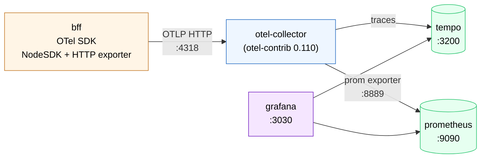

# Observability — OTel pipeline

> Current-state pipeline for traces and metrics, shipped under the `obs`
> Compose profile. **Canonical home for the trace/metric topology** — the
> `next-steps/` doc tracks only what's *not yet* in.

## Pipeline



## What's in today

| Piece | Where | Notes |
|---|---|---|
| OTel SDK | `apps/bff/src/common/telemetry.ts` | NodeSDK + OTLP HTTP exporter, auto-instrumentation (HTTP, Express, pg). Manual spans on `orders.create`, `orders.manage`. |
| Collector | `infra/observability/otel-collector-config.yaml` | `otel-contrib:0.110.0` so the prometheus exporter is available. |
| Tempo config | `infra/observability/tempo.yaml` | Single-binary, OTLP gRPC/HTTP ingest, HTTP query API on `:3200`. |
| Prometheus config | `infra/observability/prometheus.yaml` | Scrapes the collector's prom exporter on `:8889`. |
| Grafana provisioning | `infra/observability/grafana/` | Anonymous viewer enabled, admin/admin, Tempo + Prometheus datasources, `BFF Overview` dashboard. |

## Pinned env var (important)

`infra/docker/compose.yaml` hardcodes:

```yaml
OTEL_EXPORTER_OTLP_ENDPOINT=http://otel-collector:4318
```

for the BFF container. **Don't move this to `.env`** — a host-side override
(commonly `http://localhost:4318` for k6 host-mode) would silently break
in-container tracing. The collector's hostname is correct only inside the
Docker network.

## Operator surfaces

| URL | Purpose |
|---|---|
| http://localhost:3030 | Grafana — `BFF Overview` dashboard, Explore → Tempo TraceQL |
| http://localhost:9090 | Prometheus — raw query / target health |
| http://localhost:3200 | Tempo HTTP API — used by `./dev hack trace` |

## `./dev hack trace`

`./dev hack trace <METHOD> <path> [--body JSON]`:

1. Generates a W3C `traceparent` header.
2. Calls the BFF with it.
3. Polls Tempo for the trace ID until the spans appear.
4. Pretty-prints the span tree.

Refuses if Tempo is unreachable; hints the user to `./dev up obs`.

```bash
./dev up obs                              # one-time per session
./dev hack trace GET /catalog/products
./dev hack trace POST /checkout --body '{"customerName":"Smoke"}'
```

## What's not yet in

Tracked in [`../next-steps/observability-grafana.md`](../next-steps/observability-grafana.md):

1. **Loki + structured BFF logs** — the logs pipeline still uses the `debug`
   exporter (stdout).
2. **BFF metrics reader** — `telemetry.ts` only configures a trace exporter, so
   the dashboard metric panels populate only from k6 runs.
3. **Alerting** — no Prometheus alert rules yet; SLO-shaped thresholds (5xx
   rate, p95 on `/checkout`) are the obvious first cuts.
4. **Trace-to-log / trace-to-profiles correlation** — depends on logs + metrics
   landing first.

## Related

- BFF cross-cutting concerns: [`bff-modules.md`](bff-modules.md#cross-cutting-concerns)
- Containers: [`containers.md`](containers.md)
- Orchestrator (how `./dev up obs` resolves to compose profiles): [`orchestrator-python.md`](orchestrator-python.md)
