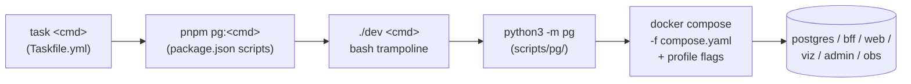

# Orchestrator — Python `pg` CLI

Single source of truth for local orchestration. Replaces the previous
dual-CLI setup (`./dev` bash + `scripts/playground.mjs` Node).

## Why Python

- One language for the entire orchestrator (was bash + Node + bash shims).
- Core commands are stdlib-only: no `pip install` is required for stack,
  smoke, or debugging commands. `perf:*` deliberately loads Punch's pinned
  PyYAML dependency; install it with
  `python3 -m pip install -r vendor/punch/requirements.txt`.
- Subprocess + argparse + urllib gives us everything we need for compose
  shelling, HTTP smoke checks, and SSE frame assertion.
- The `pg hack` namespace (see below) is much easier to grow in Python than
  in bash.

## Layout

```
scripts/pg/
  __main__.py     # entry: `python -m pg`
  cli.py          # dispatch (argparse-shaped, hand-rolled for colon names)
  compose.py      # docker compose wrapper (profiles + extra files)
  env.py          # .env load + auto-bootstrap from .env.example
  paths.py        # repo root, compose paths, port constants
  ansi.py         # color helpers (NO_COLOR + non-TTY aware)
  ports.py        # port-in-use + PID lookup
  http.py         # urllib + http.client helpers (incl. SSE reader)
  doctor.py up.py down.py dev.py smoke.py seed.py
  status.py logs.py open_cmd.py perf.py k6runner.py hack.py
  tests/          # unittest smoke tests
```

## Entry points



All three user-facing entrypoints converge on `python3 -m pg`. Pick whichever
fits your muscle memory; the behaviour is identical.

### Performance branch

`perf:*` follows a distinct, explicit dependency boundary:

```text
./dev perf:* -> repository YAML -> Punch load/validate/confirm ->
one docker compose run -> stdout/stderr log + existing HTML/JSON + optional CSV
```

The repository owns two workflow files under
`tests/performance/k6/workflows/`, one per TypeScript build entry. The Python
adapter selects exactly one file; Punch's public APIs load it, allow-list its
environment, and construct the one Compose run. Build the image separately:

```bash
python3 -m pip install -r vendor/punch/requirements.txt
docker compose -f infra/docker/compose.performance.yaml build k6
./dev perf:smoke
```

No current workflow has `outputs.csv`. A future declared CSV output accepts
only exact stdout `[CSV]` records, needs `--confirm-output-data` when run
non-interactively, fails if it yields zero valid records, and is atomically
published only after a successful run. Stderr remains log-only.

## Command map

| Command                  | Purpose                                        |
| ------------------------ | ---------------------------------------------- |
| `doctor`                 | Validate Docker / Python / .env state          |
| `up [target] [--fresh]`  | Start core/web/viz/admin/obs/full stack        |
| `down` / `reset`         | Stop (and reset, with explanation)             |
| `restart [target]`       | Stop then up                                   |
| `dev`                    | `docker compose watch` (HMR for bff + web)     |
| `dev:host`               | `turbo run dev` on host (escape hatch)         |
| `smoke`                  | 13 endpoint checks incl. SSE frame assertion   |
| `seed`                   | `prisma db seed`                               |
| `status` / `logs` / `open` | Inspection                                   |
| `perf:smoke` / `perf:purchase-flow` / `perf:purchase-flow-browser` | named k6 YAML workflows in Docker (`purchase-flow` configurable via `VUS`/`DURATION`/`BASE_URL`; `purchase-flow-browser` mirrors it via a real Chromium browser against the web app, `VUS`/`ITERATIONS`/`BASE_URL`) |
| `perf:open-report` / `perf:clean` | Manage k6 report artefacts             |
| `hack {exec,env,sql,trace}` | Debugging affordances (see below)            |

## `pg hack`

Daily debugging affordances; replace the muscle-memory `docker compose
exec` / `psql` / `curl` incantations.

### `hack exec <svc> [-- cmd args...]`
Drops you into the right shell (probes for `bash`, falls back to `sh`).
With a `--` separator, runs a one-off command.

```bash
./dev hack exec bff                       # interactive shell
./dev hack exec bff -- node --version     # one-off command
./dev hack exec postgres --shell sh       # force a specific shell
```

### `hack env <svc>`
Three-column table: variable, value as printed by `printenv` inside the
container, value in root `.env`. Differences highlighted; container-only
and `.env`-only counted separately. Use this when the answer to "why is
this env var wrong" isn't obvious.

### `hack sql [--query Q | --file F] [--json]`
One-shot psql against the postgres service. With `--json`, wraps the
query in `json_agg(row_to_json(...))` and pretty-prints. No flags →
interactive psql.

```bash
./dev hack sql --query 'SELECT count(*) FROM "Product";'
./dev hack sql --file scripts/fixtures/extra-seed.sql
./dev hack sql --query 'SELECT "productId", name FROM "Product";' --json
```

### `hack trace <METHOD> <path> [--body JSON]`
Generates a W3C `traceparent` header, calls the BFF with it, polls
Tempo (`obs` profile) for the trace, and pretty-prints the span tree.

```bash
./dev up obs                              # one-time per session
./dev hack trace GET /catalog/products
./dev hack trace POST /checkout --body '{}'
```

Refuses to run if Tempo isn't reachable, with a hint to bring the `obs`
profile up.

## Tests

```bash
pnpm pg:test                          # runs unittest under scripts/pg/tests
cd scripts && python3 -m unittest discover -s pg/tests -p 'test_*.py'
```

CI runs ruff lint + unittest in the `python` job.
