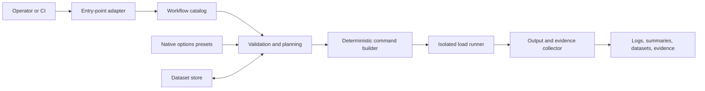

# Performance Workflow Orchestrator — Reference Architecture and Implementation Guide

Reference architecture and implementation guide for building a descriptor-driven
performance-test orchestrator in a restricted enterprise environment. The design
can be implemented independently: it requires no runtime dependency on this
repository and does not assume access to its workflow names, scenarios, or data.

This document owns the **portable pattern**. Repository-specific commands and
workflow inventory remain in
[`../performance/orchestrator.md`](../performance/orchestrator.md); the local CLI
structure remains in [`orchestrator-python.md`](orchestrator-python.md). See
[`punch-implementation.md`](punch-implementation.md) for the parent integration
boundary and Punch's own implementation guide.

## Scope

The orchestrator solves five related problems:

1. Select one declarative workflow to execute.
2. Select a native load-options document independently of the workflow.
3. Validate inputs and construct one deterministic runner invocation.
4. Exchange explicitly declared datasets between workflows.
5. Size a producer from the expected demand of a later consumer workflow.

It does not define test scripts, provision the system under test, schedule a
distributed test fleet, or manage secrets. Those remain external concerns behind
the interfaces described below.

## Architecture



The adapter owns presentation only. The catalog, planner, command builder, and
collector form the reusable core. Each invocation selects and executes at most one
workflow; a sizing operation changes the selected producer's load shape but does
not execute the downstream target.

### Component responsibilities

| Component           | Owns                                                           | Must not own            |
| ------------------- | -------------------------------------------------------------- | ----------------------- |
| Entry-point adapter | CLI/menu input, display, exit-code mapping                     | Workflow-specific rules |
| Workflow catalog    | Discovery, parsing, cross-workflow links                       | Process execution       |
| Planner             | Preflight, option resolution, data plan, sizing math           | Terminal rendering      |
| Command builder     | Argument-vector construction, mounts, allow-listed environment | Shell evaluation        |
| Runner              | One isolated child execution, cancellation, exit status        | Business interpretation |
| Collector           | Logs, summaries, atomic dataset publication, evidence          | Workflow selection      |

## Portable contracts

Use technology-neutral models internally even if YAML and JSON are used at the
boundary.

### Workflow descriptor

A workflow descriptor should contain only declarative execution facts:

```yaml
apiVersion: performance.example/v1
kind: LoadWorkflow
metadata:
  name: reserve-items
  description: Reserve items without checkout
spec:
  workingDirectory: ../../..
  runner:
    service: protocol-runner
    script: /workspace/scenarios/reserve-items.js
    config: options/smoke.json
  environment:
    forward: [BASE_URL]
    required: [BASE_URL]
  data:
    directory: artifacts/data
    mountedAt: /workspace/data
    produces:
      - dataset: reservations
        columns: [reservationId, itemId]
        targets: [submit-orders]
    requires: []
  sizing:
    iterationSeconds: 1.2
    maxSeconds: 240
```

The loader should reject unknown keys, duplicate workflow names, missing files,
absolute host paths, paths escaping `workingDirectory`, invalid identifiers, and
required environment names that are not also allow-listed for forwarding.

### Options preset

An options preset is a native runner configuration, not a custom environment
translation layer. For k6, that means a JSON object accepted by
`k6 run --config`:

```json
{
  "scenarios": {
    "default": {
      "executor": "shared-iterations",
      "vus": 1,
      "iterations": 5,
      "maxDuration": "5m"
    }
  }
}
```

Keep load shape out of the scenario source. If a runner gives script-defined
options higher precedence than an external config, enforce that rule with a
contract test; otherwise a selected preset may be silently ignored.

### Dataset contract

A dataset is identified by name and a fixed ordered column schema. Producers
declare consumers; consumers declare required or optional inputs. The catalog must
validate both directions before execution:

- Every target exists and requires or optionally accepts the dataset.
- Every required dataset has at least one producer.
- All producers of the same dataset declare identical columns.
- Input paths remain inside the configured dataset directory.

Publication should be opt-in. Parse tagged records from stdout, validate every row,
write to a same-directory temporary file, and atomically replace the published file
only after a successful run with valid rows. Treat stderr as logs, never as data.

### Sizing policy

A producer may declare measured seconds per iteration and a runtime budget. A
target may declare its own iteration time and a safety margin. Keep these values in
descriptors so the generic planner contains no workflow or dataset names.

For one-row-per-iteration workflows, normalize a supported target preset into rows
needed `Y`:

- `shared-iterations`: `Y = iterations`
- `per-vu-iterations`: `Y = vus × iterations`
- `constant-vus`: `Y = ceil(vus × durationSeconds / targetIterationSeconds)`

Then calculate:

```text
producerIterations N = ceil(Y × (1 + targetMargin))
producerVUs V = min(N, max(1, ceil(N × producerIterationSeconds / producerMaxSeconds)))
```

Use exact decimal arithmetic for the margin calculation. Reject unsupported
executors, staged or multi-scenario configs, missing timing inputs, and non-positive
values before launching the runner.

### Evidence record

Return a typed result even when execution fails:

```text
workflow name
resolved config identity
redacted command arguments
child exit code, or preflight failure
start/end timestamps
log location and summary location
published dataset names and row counts
optional sizing plan and shortfall status
```

Generated files alone are not proof of the current run because they may be stale.
The result and matching log form the evidence record.

## Selection semantics

Workflow, options, and sizing target are separate selections.

| Selection     | Question answered                         | Result                                    | What executes         |
| ------------- | ----------------------------------------- | ----------------------------------------- | --------------------- |
| Workflow      | Which behavior should run?                | Validated workflow descriptor             | Selected workflow     |
| Options       | How should the selected workflow run?     | Config path or workflow default           | Selected workflow     |
| Sizing target | How much data will a later consumer need? | Sizing plan and generated producer config | Current producer only |

### Direct options flow

1. Select and validate one workflow.
2. Select the workflow default or another options preset.
3. Validate the preset before starting the runner.
4. Bind or copy it read-only into the runner environment.
5. Execute the selected workflow with that config unchanged.

### Target-driven sizing flow

1. Select a producer workflow.
2. Derive eligible targets from its declared dataset links.
3. Select a downstream target and the options preset intended for that target.
4. Estimate the target's row demand and create a sizing plan.
5. Generate a producer config with `N` iterations and `V` VUs.
6. Automatically opt into the datasets covered by the sizing plan.
7. Execute the producer once; do not execute the target.
8. Compare published rows with `Y` and record any shortfall.

Keep the states explicit in code. A discriminated type such as
`DirectConfig(path | default)` versus `SizedForTarget(plan)` is clearer than using
one nullable path for “default,” “no config,” and “generated config.”

## Design decisions and trade-offs

### Declarative descriptors over workflow-specific code

Descriptors make the engine reusable and reviewable. Adding a workflow changes
data, not orchestration logic. The cost is stricter schema and catalog validation;
without it, errors move from startup to an expensive test run.

### Native options over environment-derived load shape

Native configs preserve runner capabilities and make a preset usable from both
automation and an interactive menu. They also inherit runner precedence rules and
may expose unsupported executors, so compatibility must be checked before use.

### One workflow per invocation

One child process gives clear cancellation, exit codes, and evidence. Producer and
consumer chains remain operator- or pipeline-controlled. This avoids a hidden
workflow engine, at the cost of requiring a separate invocation for each step.

### Target-driven producer sizing

Sizing against future demand reduces missing-data failures and avoids hard-coded
producer counts. Its accuracy depends on measured iteration times, declared margin,
and the one-row-per-iteration assumption. Record shortfalls; do not present an
estimate as a guarantee.

### Atomic, opt-in datasets

Opt-in publication prevents ordinary smoke runs from overwriting useful fixtures.
Atomic replacement protects the last valid dataset. The trade-off is extra state
management and an explicit cleanup policy.

## Restricted-enterprise security profile

The portable core is not a security boundary by itself. Apply these controls when
recreating it in a protected environment:

1. **Offline dependency closure.** Mirror or vendor exact versions, verify hashes,
   produce an SBOM, and make builds fail on undeclared network access.
2. **Descriptor trust.** Review descriptors as code. Use safe YAML loading, reject
   aliases if unnecessary, validate unknown keys, and pin a schema version.
3. **Path containment.** Resolve every host path and prove it is beneath an approved
   workspace, options, data, reports, or state directory before reading or mounting.
4. **No shell evaluation.** Construct an argument vector and invoke the process
   without a shell. Never interpolate descriptor values into a command string.
5. **Environment allow-listing.** Forward only names declared by the workflow.
   Inject secrets through the enterprise secret mechanism, never through presets,
   descriptors, evidence, or command previews.
6. **Runner isolation.** Use a dedicated identity, read-only source/config mounts,
   bounded writable artifact directories, CPU/memory/time limits, and an explicit
   network policy limited to the system under test.
7. **Data classification.** Use synthetic inputs by default. Validate, minimize,
   encrypt, retain, and delete datasets according to policy; never collect stderr as
   structured data.
8. **Evidence hygiene.** Redact secret values and sensitive URLs. Make evidence
   append-only or integrity-protected if it supports audit decisions.
9. **Automation safety.** Interactive confirmation is a user-interface feature, not
   an authorization control. CI must use pre-authorized identities and policy gates.

## Independent implementation guide

Implement the slices in order. Each slice should be usable and testable before the
next one begins.

### 1. Define models and strict loaders

Create immutable models for workflow, runner, environment, data, sizing, summary,
and execution result. Parse one descriptor version and one native options format.
Test malformed documents, unknown keys, duplicate names, missing files, path escape,
and invalid environment declarations.

### 2. Build the catalog

Discover descriptors from one configured directory, sort them deterministically,
and validate cross-workflow dataset links. Expose queries such as
`workflow(name)`, `producersOf(dataset)`, `consumersOf(dataset)`, and
`sizingPairs(producer)`.

### 3. Build a pure command planner

Accept a validated workflow, environment map, dataset mounts, and optional config.
Return an argument vector and mount plan without starting a process. Snapshot-test
the plan and assert that undeclared environment values and out-of-root paths never
appear.

### 4. Add single-workflow execution

Run exactly one planned command, stream stdout and stderr independently, propagate
interrupts, preserve the child exit code, and always return an execution result.
Add non-interactive automation first; put menus and prompts in a separate adapter.

### 5. Add options selection

Support a workflow default and a one-run override. Resolve names inside the approved
options directory or accept an explicitly permitted path. Validate before execution
and record the resolved identity in evidence.

### 6. Add dataset exchange

Preflight required inputs, inject container-visible paths, parse tagged stdout
records, and publish valid output atomically only when explicitly requested. Test
failed processes, zero rows, malformed rows, duplicate requests, and preservation of
the previous valid file.

### 7. Add target sizing

Implement shape normalization and sizing as pure functions. Generate a producer
config by replacing only execution-shape fields while preserving safe scenario
metadata such as tags and runner-specific options. Test every supported executor,
rounding boundary, VU clamp, time-budget warning, unsupported shape, and post-run
shortfall.

### 8. Add presentation adapters

Build CLI flags for automation, then optionally add an interactive picker. Both must
call the same catalog, planner, and execution APIs. Cancellation must occur before
runner startup and return a documented exit status.

### 9. Package for the protected environment

Produce an offline installation bundle containing the orchestrator, schemas, pinned
dependencies, runner image or binary, SBOM, checksums, and verification instructions.
Keep business workflows, targets, credentials, and datasets in the protected
environment; only the generic engine and neutral examples need to cross boundaries.

## Acceptance checklist

- Invalid descriptors, configs, links, or paths fail before runner startup.
- Selecting workflow A with preset B executes A once with B.
- Selecting target C while sizing producer A executes A once and never C.
- Generated producer iterations and VUs match the documented formulas.
- Only allow-listed environment names reach the child process.
- A failed or empty producing run cannot replace the last valid dataset.
- Missing required data names its valid producers and starts no child process.
- Cancellation and child exit codes are preserved.
- Each run emits a redacted evidence record tied to its log.
- The complete system installs and runs with network access disabled.

## Source-of-truth map

These links demonstrate the reference behavior; they are not dependencies of an
independent implementation:

| Concern                                       | Reference source                                                                             |
| --------------------------------------------- | -------------------------------------------------------------------------------------------- |
| Repository workflow registry and target ports | [`../../scripts/pg/workflows.py`](../../scripts/pg/workflows.py)                             |
| Repository adapter and config resolution      | [`../../scripts/pg/k6runner.py`](../../scripts/pg/k6runner.py)                               |
| Interactive workflow/options/target selection | [`../../vendor/punch/src/punch/menu.py`](../../vendor/punch/src/punch/menu.py)               |
| Strict descriptor and config loading          | [`../../vendor/punch/src/punch/workflow.py`](../../vendor/punch/src/punch/workflow.py)       |
| Catalog link validation                       | [`../../vendor/punch/src/punch/catalog.py`](../../vendor/punch/src/punch/catalog.py)         |
| Command construction and atomic data handling | [`../../vendor/punch/src/punch/execution.py`](../../vendor/punch/src/punch/execution.py)     |
| Target-demand calculation                     | [`../../vendor/punch/src/punch/sizing.py`](../../vendor/punch/src/punch/sizing.py)           |
| Repository contract tests                     | [`../../scripts/pg/tests/test_k6_workflows.py`](../../scripts/pg/tests/test_k6_workflows.py) |

When behavior and prose disagree, update this guide from the tested source contract;
do not add a second implementation rule to the documentation.
