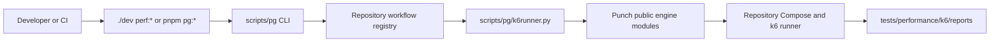

# Punch Integration Architecture

This spoke maps the portable performance-workflow architecture to the Punch
implementation used by this repository. Start with the
[portable Reference Architecture and Implementation Guide](performance-workflow-orchestrator-reference.md)
for the technology-neutral pattern. Punch's own
[Reference Architecture and Implementation Guide](../../vendor/punch/docs/architecture/reference-architecture-and-implementation-guide.md)
is the canonical description of its internals and clean-room reproduction path.

This page owns only the integration boundary. It intentionally does not duplicate
Punch's workflow, data, sizing, or execution contracts.

## Integration view

The parent repository owns business-facing command names and its workflow registry.
Punch owns generic descriptor loading, catalog validation, data planning, sizing,
command construction, execution, and dataset publication. Compose and k6 own the
runtime network and the actual test behavior.

## Ownership boundary

| Owner             | Responsibilities                                                                                | Examples                               |
| ----------------- | ----------------------------------------------------------------------------------------------- | -------------------------------------- |
| Parent repository | Developer commands, workflow inventory, target URLs, report locations, repository-specific help | `scripts/pg/`, `tests/performance/k6/` |
| Punch             | Reusable workflow contracts and orchestration policy                                            | `vendor/punch/src/punch/`              |
| Workflow author   | Scenario logic, thresholds, summary output, data tags                                           | k6 TypeScript and workflow YAML        |
| Runtime           | Container isolation, service discovery, process exit status                                     | Docker Compose and k6                  |

The adapter imports supported Punch functions instead of reimplementing them. This
keeps the public example small while the portable guides describe how a protected
environment can build an equivalent engine without importing either repository.

## Request path

1. `./dev` or `pnpm pg:*` routes to the parent Python CLI.
2. The registry resolves a stable command name to one workflow descriptor.
3. The adapter loads that descriptor and its directory-wide Punch catalog.
4. A normal options choice resolves a native k6 JSON config for that workflow.
5. A sizing choice resolves a target workflow and config, then asks Punch to create
   a producer plan. The target is demand input and is not executed.
6. Punch preflights environment, data, paths, and output collisions.
7. Punch constructs one Compose command, executes it, and returns a typed result.
8. The parent adapter maps the result to repository output and exit-code conventions.

## Integration invariants

- One parent workflow command produces at most one Compose run.
- Workflow identifiers and aliases live in the parent registry, not in Punch.
- Descriptors and native k6 configs remain the source of execution facts.
- The parent adapter does not parse Punch's terminal output to determine success.
- Data and sizing policy stays in Punch; repository-specific paths and UX stay in
  the parent.
- Normal options selection and target sizing are separate operations.
- The submodule is a reference implementation, not a required dependency of the
  protected-environment design described by the portable guide.

## Change guide

| Change                                           | Primary owner                               | Validation                                               |
| ------------------------------------------------ | ------------------------------------------- | -------------------------------------------------------- |
| Add or rename a `perf:*` command                 | Parent registry/CLI                         | Parent orchestrator tests                                |
| Add a workflow or options preset                 | Repository performance fixtures             | Descriptor/catalog and workflow tests                    |
| Change workflow schema, data exchange, or sizing | Punch                                       | Punch unit and contract tests, then parent adapter tests |
| Change Compose service or mount                  | Repository runtime plus affected descriptor | Command contract and smoke run                           |
| Change evidence or report path                   | Owning adapter and consumers                | Artifact/evidence contract tests                         |

## Source-of-truth map

| Concern                  | Source                                                                                                                                                                         |
| ------------------------ | ------------------------------------------------------------------------------------------------------------------------------------------------------------------------------ |
| Parent workflow registry | [`scripts/pg/workflows.py`](../../scripts/pg/workflows.py)                                                                                                                     |
| Parent-to-Punch adapter  | [`scripts/pg/k6runner.py`](../../scripts/pg/k6runner.py)                                                                                                                       |
| Parent contract tests    | [`scripts/pg/tests/test_k6_workflows.py`](../../scripts/pg/tests/test_k6_workflows.py)                                                                                         |
| Punch architecture       | [`vendor/punch/docs/architecture/reference-architecture-and-implementation-guide.md`](../../vendor/punch/docs/architecture/reference-architecture-and-implementation-guide.md) |
| Punch engine             | [`vendor/punch/src/punch/`](../../vendor/punch/src/punch/)                                                                                                                     |
| Local workflow operation | [`docs/performance/orchestrator.md`](../performance/orchestrator.md)                                                                                                           |

If this integration view disagrees with code, use the parent adapter and its tests
for integration facts and Punch's source and tests for engine facts.
