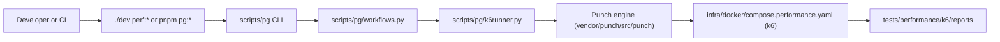

# Punch Integration and Documentation Index

Punch (`vendor/punch/`) is the performance-workflow engine behind `./dev perf:*`.
This page owns only the Expresso ↔ Punch boundary and indexes Punch's own docs;
it never restates Punch's contracts.

## Punch documentation index

| Read                                                                                                                                       | For                                                                         |
| ------------------------------------------------------------------------------------------------------------------------------------------ | --------------------------------------------------------------------------- |
| [Reference Architecture and Implementation Guide](../../vendor/punch/docs/architecture/reference-architecture-and-implementation-guide.md) | The solution, design decisions, and how to reproduce its core independently |
| [Architectural Boundaries](../../vendor/punch/docs/architecture/punch-boundaries.md)                                                       | Punch's layer ownership map                                                 |
| [README](../../vendor/punch/README.md)                                                                                                     | `punch run` / `punch menu` usage and flags                                  |
| [Workflow Validation](../../vendor/punch/docs/workflows/validation.md)                                                                     | Run evidence contract (`reports/state/punch-run.json`)                      |
| [Spec: native k6 config](../../vendor/punch/docs/specs/spec-native-k6-config.md)                                                           | Load shape via `k6 run --config`                                            |
| [Spec: consumer/producer switch](../../vendor/punch/docs/specs/spec-consumer-producer-switch.md)                                           | Data-source pickers and producer switching                                  |
| [Spec: target data sizing](../../vendor/punch/docs/specs/spec-target-data-sizing.md)                                                       | `spec.sizing` and `--size-for`                                              |

Expresso-side operation (workflows, datasets, presets, CI gate):
[`../performance/orchestrator.md`](../performance/orchestrator.md).

## Integration view

| Owner    | Owns                                                                   | Where                                  |
| -------- | ---------------------------------------------------------------------- | -------------------------------------- |
| Expresso | `perf:*` command names, workflow inventory, target ports, report paths | `scripts/pg/`, `tests/performance/k6/` |
| Punch    | Loading, catalog, data planning, sizing, command build, execution      | `vendor/punch/src/punch/`              |
| Authors  | Scenario logic, thresholds, summary output, `[DATA]` tags              | k6 TypeScript + workflow YAML          |
| Runtime  | Isolation, networking, exit status                                     | Docker Compose + k6                    |

`k6runner.py` imports Punch's public functions instead of reimplementing them,
then maps Punch's typed result to `./dev` output and exit codes.

## Integration invariants

- One `perf:*` command → one workflow → at most one Compose run.
- Command names live in the Expresso registry, not in Punch.
- Workflow YAML and native k6 configs are the only source of execution facts.
- The adapter reads Punch's typed result, never its terminal output.
- Data and sizing policy stay in Punch; repository paths and UX stay here.
- A `vendor/punch` pointer bump must reference a commit already on Punch's
  remote, or CI checkout fails.

## Change guide

| Change                                  | Owner                      | Validate with                             |
| --------------------------------------- | -------------------------- | ----------------------------------------- |
| Add or rename a `perf:*` command        | `scripts/pg/workflows.py`  | `pnpm pg:test`                            |
| Add a workflow or options preset        | `tests/performance/k6/`    | `pnpm pg:test` (workflow + catalog tests) |
| Change schema, data exchange, or sizing | Punch                      | Punch tests, then `pnpm pg:test`          |
| Change the k6 Compose service or mounts | `infra/docker/` + workflow | Command contract tests + one `perf:*` run |

Engine facts: Punch source and tests. Integration facts:
[`k6runner.py`](../../scripts/pg/k6runner.py) and
[`test_k6_workflows.py`](../../scripts/pg/tests/test_k6_workflows.py).
