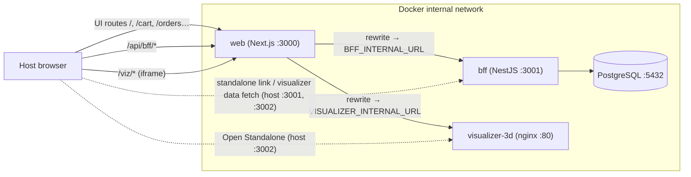

# Web App as Entry Point + Internal Service Proxy

> Current-state architecture. Captured 2026-05-29. For the feature/UX inventory
> see [../project-state/current-system.md](../project-state/current-system.md).

## Principle

The web app is the **single browser-facing entry point**. The browser only
talks to the web app's own origin. The web **server** (Next.js) proxies to the
other containers over the internal Docker network. This keeps the BFF and
visualizer reachable without exposing them to the browser as dependencies and
removes the CORS requirement for the main app.

## Request topology

Solid edges are the primary product path (browser → web → internal service).
Dashed edges are preserved secondary paths: the standalone visualizer view and
the visualizer's own browser → BFF data fetch still use host ports.

## `/api/bff` proxy (web → BFF)

- `apps/web/next.config.mjs` rewrites `/api/bff/:path*` → `${BFF_INTERNAL_URL}/:path*`.
- `apps/web/src/lib/api/expresso-api.ts` resolves the base URL:
  - Browser → same-origin `/api/bff` (no CORS, web app is the entry point).
  - Server-side code → `BFF_INTERNAL_URL` (or `http://localhost:3001` fallback).
  - `NEXT_PUBLIC_API_BASE_URL`, if set, is an explicit override of both.

## `/viz` proxy (web → visualizer)

- `next.config.mjs` rewrites `/viz/:path*` → `${VISUALIZER_INTERNAL_URL}/:path*`.
- The `/visualizer` page embeds the iframe at **`/viz/index.html`** (not the
  bare `/viz/`). Next.js strips trailing slashes (`/viz/` → 308 → `/viz`), which
  would make the visualizer's _relative_ asset paths resolve to `/scene.js`.
  Pointing at `/viz/index.html` keeps the document base under `/viz/`, so
  `./scene.js` resolves to `/viz/scene.js` and is proxied correctly.
- The visualizer serves no `X-Frame-Options`/CSP frame headers, so same-origin
  embedding works.
- **Homepage embed:** the unified workspace at `/` also mounts the visualizer,
  using `/viz/index.html?embed=1`. The `?embed=1` flag is consumed inside
  `apps/visualizer-3d/public/index.html` and hides the HUD via a CSS-only
  `body.embed` rule — `scene.js` is untouched and the SSE/polling contract is
  unchanged. The standalone `/visualizer` route omits the flag and keeps the
  HUD visible for direct inspection.

## Environment variable matrix

`NEXT_PUBLIC_*` values are inlined into the client bundle at build time. Rewrite
targets are resolved when `next.config.mjs` loads (build time for the standalone
server, server start for `next dev`). So the production image needs build args,
and the dev/watch stage needs runtime env — both are set in
`infra/docker/compose.yaml`.

| Variable                     | Scope                    | Default                   | Used for                       |
| ---------------------------- | ------------------------ | ------------------------- | ------------------------------ |
| `BFF_INTERNAL_URL`           | server (build arg + env) | `http://bff:3001`         | `/api/bff` rewrite target      |
| `VISUALIZER_INTERNAL_URL`    | server (build arg + env) | `http://visualizer-3d:80` | `/viz` rewrite target          |
| `NEXT_PUBLIC_VISUALIZER_URL` | client (build arg)       | `http://localhost:3002`   | "Open Standalone" link only    |
| `NEXT_PUBLIC_API_BASE_URL`   | client (optional)        | unset                     | Explicit override of the proxy |

For host dev without Docker (`pnpm pg:dev:host`), leave the internal URLs unset
so they fall back to `localhost`. Compose sets the in-container service names
automatically; `.env.example` keeps them commented for this reason.

## Boundary rules

- Visual components never call `fetch` directly — they go through
  `expresso-api.ts`, which targets the proxy.
- The web frontend owns no Three.js or visualization-transformation code; the
  visualizer reads `GET /visualization-data` only.
- `@mini-commerce/contracts` is the shared wire-format boundary; the proxy does
  not reshape payloads.
- The Next.js standalone server entrypoint in a pnpm monorepo is
  `apps/web/server.js` (the Docker `CMD` reflects this).

## Related

- Current features and UX: [../project-state/current-system.md](../project-state/current-system.md)
- Architecture index: [README.md](README.md)
