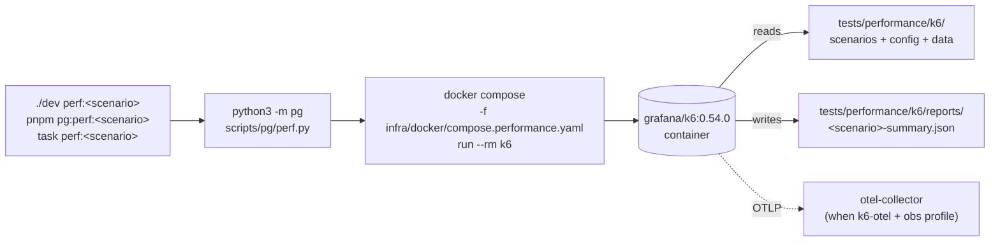

# Performance Orchestrator

Design of the repo's native performance engineering layer. Canonical home
for the rules that govern `scripts/pg/perf.py`,
`infra/docker/compose.performance.yaml`, and the k6 scenario library under
`tests/performance/k6/`.

## Goals

1. Run k6 reproducibly against the local BFF with **one command** from a
   fresh checkout: `./dev perf:smoke`.
2. Keep orchestration logic in **Python**, alongside the rest of the local
   developer CLI.
3. Keep the runtime in **Docker** so the host needs no k6 install.
4. Keep the perf stack isolated from the main Compose lifecycle.
5. Produce diffable summary artifacts per scenario.
6. Stay small. Add only what the next concrete need requires.

## Non-goals

- A general-purpose load-testing platform.
- Cross-repo / multi-service orchestration.
- Cloud runners, distributed k6, custom queueing.
- CI gating by default. CI runs are added per-scenario with owner sign-off.

## Architecture



All three user-facing entry points (`./dev`, `pnpm pg:*`, `task`) converge on
`python3 -m pg`. The Python orchestrator owns argument parsing, BFF
liveness hinting, container spawning, and report path resolution.

## Layout

```
scripts/pg/
  perf.py                    # smoke / checkout_flow / read_heavy / open_report / clean
  cli.py                     # perf:* entry registration
infra/docker/
  compose.performance.yaml   # k6 + k6-otel services (separate file)
tests/performance/k6/
  config/
    env.js                   # url() — single BASE_URL knob
    thresholds.js            # named threshold sets
  data/
    products.json            # static fixtures
  scenarios/
    smoke/smoke.js
    checkout-flow/checkout-flow.js
    read-heavy/read-heavy.js
    load/load.js             # placeholder for nominal-load refinement
    stress/stress.js         # placeholder for beyond-nominal refinement
  reports/                   # gitignored except .gitkeep
docs/performance/
  orchestrator.md            # this file
  validation.md              # evidence rules
```

## Invariants

These are load-bearing. Changes that break them require owner sign-off.

1. **k6 runs in Docker.** No host install of k6 is required to execute
   `./dev perf:*`. Host-installed k6 is an optional escape hatch
   documented in the k6 README, never a default code path.
2. **Python owns orchestration.** `dev` is a bash trampoline; new
   orchestration logic lives in `scripts/pg/` and stays stdlib-only.
3. **Compose file stays separate.** `compose.performance.yaml` does not
   mutate the main stack. Perf runs do not bring up the main `core`,
   `web`, or `viz` profile.
4. **`BASE_URL` is the single target knob.** Scenarios read it via
   `config/env.js`; the orchestrator resolves the default
   (`http://host.docker.internal:${BFF_PORT}`); CLI overrides win.
5. **Reports are stable + diffable.** Each scenario writes a summary at a
   predictable path (`reports/<scenario>-summary.json`). Reports are
   gitignored except `.gitkeep`.
6. **Thresholds are named and shared.** New thresholds live in
   `config/thresholds.js` as named sets, imported by the scenario.
   Inlining thresholds is a review red flag.
7. **No secrets, no real URLs, no real user data** in scenarios or
   fixtures. The domain is fictional.

## Entry points today

| Command | Scenario | Summary file |
|---|---|---|
| `./dev perf:smoke` | `smoke/smoke.js` | `smoke-summary.json` |
| `./dev perf:checkout-flow` | `checkout-flow/checkout-flow.js` | `checkout-flow-summary.json` |
| `./dev perf:read-heavy` | `read-heavy/read-heavy.js` | `read-heavy-summary.json` |
| `./dev perf:open-report` | — | lists report files |
| `./dev perf:clean` | — | clears `reports/` |

`pnpm pg:perf:*` and `task perf:*` are user-facing equivalents. The
`k6-otel` Compose service is opt-in for runs that need OTLP export to the
collector running under the `obs` profile.

## Extending the orchestrator

Steps for adding a new scenario (e.g. `cart-mutations`):

1. Decide whether the new shape belongs in an existing profile or warrants
   a new directory under `scenarios/`.
2. Create `tests/performance/k6/scenarios/cart-mutations/cart-mutations.js`.
   - Import `url()` from `config/env.js`.
   - Import the relevant named threshold set from `config/thresholds.js`.
     Add a new set if needed; do not inline.
   - Make VUs / duration / ramp explicit and bounded.
3. Add a `cart_mutations()` function in `scripts/pg/perf.py` reusing
   `_run_scenario(label, scenario_path, summary_filename)`.
4. Register `perf:cart-mutations` in `scripts/pg/cli.py`.
5. Add `pg:perf:cart-mutations` to `package.json` scripts and
   `perf:cart-mutations` to `Taskfile.yml` if the user-facing entry points
   are expected.
6. Update `tests/performance/k6/README.md` and this document.
7. Run the orchestrator unit tests: `pnpm pg:test`.
8. Run the new scenario locally: `./dev perf:cart-mutations`. Commit the
   resulting threshold rationale to `config/thresholds.js`.

Steps for changing a threshold:

1. Justify the change with empirical data from a real run; quote the
   metric and exit code.
2. Edit `config/thresholds.js`. Keep the change to the named set only.
3. Re-run the affected scenario and capture the summary.
4. Note the rationale in the PR description, not in source comments.

Steps for changing Compose wiring:

1. Edit `compose.performance.yaml`. Keep `k6` and `k6-otel` symmetric.
2. Preserve `extra_hosts: host.docker.internal:host-gateway` for Linux.
3. If joining the `mini_commerce` external network, document the dependency
   on the main stack being up.
4. Update `docs/architecture/containers.md` if the change affects the
   container map.

## What this layer deliberately does not do

- It does not own CI scheduling. CI gating per scenario is a separate,
  per-scenario decision with owner sign-off; the default lives locally.
- It does not export to dashboards by default. The `k6-otel` service is
  opt-in; routing into Grafana / Tempo / Prometheus boards is future work.
- It does not generate synthetic users, browsers, or session state beyond
  the BFF's own contracts. Scenarios target the BFF API surface.
- It does not own assertions about correctness — that belongs to the BFF
  test suite. k6 asserts performance characteristics under load.

## Related

- [`validation.md`](validation.md) — performance validation evidence rules.
- [`../architecture/containers.md`](../architecture/containers.md) —
  container map and profile contract.
- [`../architecture/orchestrator-python.md`](../architecture/orchestrator-python.md) —
  Python `pg` CLI design.
- [`../../tests/performance/k6/README.md`](../../tests/performance/k6/README.md) —
  scenario library overview.
