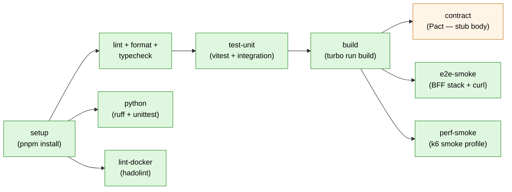

# Quality Engineering Strategy

The mini-commerce playground treats quality as a **systemic property**, not
a phase. This document captures the test pyramid, ownership model, and
quality gates.

## 1. Test pyramid

| Layer        | Goal                                              | Tool       | Location                  |
| ------------ | ------------------------------------------------- | ---------- | ------------------------- |
| Unit         | Verify a single function / class behavior.        | Vitest     | `apps/*`, `packages/*`    |
| Integration  | Verify modules collaborate across real I/O.       | Vitest     | `tests/integration`       |
| Contract     | Verify producer/consumer wire compatibility.      | Pact       | `tests/contract`          |
| E2E          | Verify golden paths in the running stack.         | Playwright | `tests/e2e`               |
| Performance  | Verify latency and throughput against SLOs.       | k6         | `tests/performance/k6`    |

The pyramid is **load-bearing**: more tests at the bottom, fewer at the top.
A failing integration test should never be replaced by an E2E test as a
shortcut — that pushes cost up.

## 2. Ownership

- **Feature engineers** own unit and integration tests for the modules
  they change (catalog, cart, checkout, orders).
- **Producer + consumer engineers jointly** own contract tests at their
  shared boundary (web ↔ bff).
- **Quality engineering** owns the E2E suite — what counts as a "golden
  path" is a quality call, not a feature call. The mini-commerce golden
  path is `load catalog → add to cart → checkout → manage order`.
- **Performance engineering** owns the k6 solution and SLO thresholds.

## 3. Quality gates

### Enforced today

1. **Setup** — `pnpm install --frozen-lockfile`.
2. **Lint + format + typecheck** — `pnpm lint` (ESLint flat config),
   `pnpm format` (Prettier), `pnpm typecheck` (`tsc --noEmit`). No more
   `|| true` escape hatches.
3. **Python orchestrator** — `ruff check scripts/pg` + `unittest discover`
   under `scripts/pg/tests/`.
4. **Hadolint** — every Dockerfile under `apps/*/Dockerfile` (DL3018 ignored
   on workspace bases).
5. **Unit + integration** — `pnpm test` (Vitest) and `pnpm test:integration`.
6. **Build** — `pnpm build` across the workspace.
7. **E2E smoke** — boots the Compose BFF stack, waits for `/health`, runs
   `pnpm test:e2e` (stub body), tears down.
8. **Performance smoke** — `pnpm pg:perf:smoke` (k6 smoke profile).

### Stubbed (job runs, body is a TODO)

- **Contract verification** under `tests/contract` (Pact).
- **Playwright E2E** under `tests/e2e`.

### Planned

- Nightly load/stress (k6 `checkout-flow`, `read-heavy`) outside the per-PR
  pipeline.
- Dependency scanning.
- SLO-based alerting rules in Prometheus (see
  [`../architecture/observability.md`](../architecture/observability.md)).

## 4. Local developer validation

Before any of the layers above, `pnpm pg:smoke` (alias `./dev smoke`)
provides a fast developer-loop validation: 13 checks across the active BFF
endpoints (`/health`, `/catalog/*`, cart CRUD, `/checkout`, `/orders/*`,
`/visualization-data`) **plus a Server-Sent Events frame assertion** against
`/visualization-updates`. Asserts `200/201/202` and a non-empty `data:` frame
within a deadline. It is the local equivalent of a smoke E2E test and is what
the rest of the pipeline plugs into.

## 5. Testability principles

- **Modules expose narrow public surfaces.** Tests target those surfaces,
  not internals.
- **Time and randomness are injected.** Tests stay deterministic — the
  fixtures and test setup should keep persisted flows deterministic so
  contract/smoke tests do not flake.
- **Observability is testable.** Tests can assert on emitted spans or
  metrics where it adds value.
- **No real external services in CI.** Use testcontainers, contract mocks,
  or in-memory fakes from `@mini-commerce/test-utils`.

## 6. Anti-patterns to avoid

- Big E2E suites used as a substitute for missing integration tests.
- Snapshot tests on rapidly-evolving outputs.
- Shared mutable test fixtures.
- Mocks of types we own (use real implementations or in-memory fakes
  instead).
