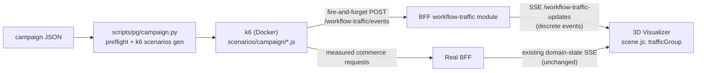

# Live Workflow Traffic and Falling Cups — Implementation Spec

Status: Proposed

Related specifications:
[`executable-use-cases-and-live-traffic.md`](executable-use-cases-and-live-traffic.md)
(SPEC-003 through SPEC-008 — this document implements a scoped subset of
those requirements),
[`live-traffic-visualizer-e2e-certification.md`](live-traffic-visualizer-e2e-certification.md)
(certification against this implementation is future work, not covered
here).

## Purpose

This specification defines how the repository builds a minimal, real
campaign runner and a live falling-cup visualization so that running a
small load campaign against the real BFF produces visible, distinguishable
falling cups in the 3D Visualizer — driven by real endpoint traffic, not a
mock or a canned animation.

The visible falling-cup behavior is the deliverable this spec exists to
produce. The campaign runner and the workflow-traffic feed are necessary
supporting infrastructure, scoped to exactly what the falling cups need and
no further.

## Scope

This document implements:

- SPEC-003 (Custom load campaign configuration) — **narrowed**: a thin JSON
  campaign descriptor translated into k6's native `options.scenarios`
  config, not a new generic execution engine.
- SPEC-004 (Executable complex workflows) — **narrowed to three adapters**:
  `commerce.catalog-browse`, `commerce.order-lookup`, `commerce.purchase`.
- SPEC-005 (Iteration, selection, and reporting) — a stable per-run summary
  file, reusing k6's `handleSummary`.
- SPEC-006 (Concurrency safety) — preflight enforcement of each catalog
  entry's `concurrency` field, before Docker starts.
- SPEC-007 (Live workflow traffic event contract) — a new BFF module and
  SSE stream, event-based (not snapshot-based).
- SPEC-008 (Falling coffee-cup visualization) — **core only**: cups fall,
  land, show a distinguishable failure treatment, and a HUD shows run and
  use-case identity. Pause/resume/clear controls are deferred.

Explicitly deferred to follow-up work:

- SPEC-009 (aggregation, sampling, configurable bounded rendering). This
  spec ships a single hard cap on concurrent cups as a safety net only —
  not a configurable adapter.
- Pause/resume/clear controls (part of SPEC-008's full requirement list).
- Adapters for `commerce.cart-edit`, `commerce.order-fulfillment`,
  `visualization.observe-state`, `visualization.subscribe-live`.
- The CERT-001 through CERT-011 automated certification suite. This
  implementation makes that suite possible but does not build it.

## Requirement language

`MUST` identifies behavior required for this implementation to be
considered complete. `SHOULD` identifies preferred behavior unless a
documented constraint prevents it. `MAY` identifies optional behavior.

## Definitions

- **Campaign**: one execution of the k6 campaign entry script against a
  selected set of catalog use cases, identified by a `runId`.
- **Iteration**: one execution of one adapter's ordered actions for one
  simulated user, from the first action to its terminal outcome.
- **Workflow-traffic event**: a `started`, `succeeded`, or `failed` record
  for one iteration, carrying `runId`, `useCaseId`, `useCaseVersion`, and
  `iterationId`.
- **Traffic cup**: a 3D object in the Visualizer representing one
  in-flight or recently-terminal iteration. Distinct from the existing
  domain-state cup rendered for products/cart (`buildEspressoGroup`).

## Architecture



The workflow-traffic path (`FEED`) is independent of the domain-state path.
Neither k6's commerce requests nor the domain-state SSE stream change.

## RUN-001: Campaign descriptor and k6 translation

### Requirements

- The repository MUST accept a campaign descriptor JSON with: `runId`,
  selected `useCases` (id, version, weight), `durationSeconds`, and
  `visualization.enabled`.
- `scripts/pg/campaign.py` MUST read the descriptor plus
  `use-cases/catalog.json`, resolve each selected use case's `adapter` id
  to a scenario file under `tests/performance/k6/scenarios/campaign/`, and
  generate a k6 `options.scenarios` object using k6's native
  `per-vu-iterations` or `constant-vus` executor, weighting VUs by the
  descriptor's `weight` values.
- The generator MUST NOT invent new execution semantics (rate curves,
  ramp stages, custom schedulers) beyond what k6's native executors
  already express. If a use case needs an executor shape not covered by
  `constant-vus`, the descriptor is out of scope for this spec.
- The Python layer MUST stay stdlib-only, per the orchestrator's existing
  invariant.

### Example descriptor

```json
{
  "runId": "morning-rush",
  "useCases": [
    { "id": "commerce.catalog-browse", "version": 1, "weight": 3 },
    { "id": "commerce.order-lookup", "version": 1, "weight": 2 },
    { "id": "commerce.purchase", "version": 1, "weight": 1 }
  ],
  "durationSeconds": 60,
  "visualization": { "enabled": true }
}
```

### Acceptance criteria

- Two different valid descriptors produce two different weighted mixes
  through the same `scripts/pg/campaign.py` entry point.
- The generated k6 config never exceeds a use case's declared
  `concurrency.maxVirtualUsers`.

## RUN-002: Preflight validation (SPEC-006)

### Requirements

- Before invoking Docker, `scripts/pg/campaign.py` MUST reject a
  descriptor that: references an unknown use-case id or version,
  references a `status: "deprecated"` use case, or assigns a use case
  more virtual users than its `concurrency.maxVirtualUsers` allows
  (`commerce.purchase` and `commerce.cart-edit` currently cap at 1).
- A rejected descriptor MUST fail with a message naming the offending use
  case and the violated limit, and MUST NOT start any container.

### Acceptance criteria

- A descriptor requesting 2 VUs for `commerce.purchase` fails preflight
  with `commerce.purchase` and `maxVirtualUsers: 1` named in the message.
- A descriptor referencing an unknown use-case id fails preflight without
  starting `docker compose`.

## RUN-003: Executable adapters (SPEC-004, narrowed set)

### Requirements

- `tests/performance/k6/scenarios/campaign/` MUST contain one file per
  adapter: `catalog-browse.js`, `order-lookup.js`, `purchase.js`,
  implementing the ordered `actions` from their catalog entry.
- Each adapter MUST maintain iteration-local context (captured
  `product_id`, `order_id`) across its actions, per SPEC-004.
- Each adapter MUST define a success check per required action and fail
  the iteration (and skip dependent actions) when a required action's
  check fails.
- Each request MUST carry `tags: { use_case, use_case_version, run_id }`
  so k6 metrics remain groupable by use case.
- `tests/performance/k6/scenarios/campaign/report-event.js` MUST export a
  `reportEvent(useCase, iterationId, outcome)` helper that all three
  adapters call: once with `outcome: "started"` before the first action,
  once with `outcome: "succeeded"` or `outcome: "failed"` at the
  iteration's terminal point. The helper generates `iterationId` once per
  iteration (e.g. `${__VU}-${__ITER}-${Date.now()}`) and reuses it for both
  calls.
- `reportEvent` MUST NOT throw or block the iteration if the POST fails;
  it MUST swallow the error after a short timeout, per SPEC-007's
  "disconnection must not fail the campaign" rule applied to the emitting
  side.

### Acceptance criteria

- A `commerce.purchase` iteration browses, selects a product, adds it to
  the cart, places an order, captures the order id, and verifies that
  order — matching SPEC-004's named acceptance example.
- Killing the workflow-traffic ingest endpoint mid-run does not fail or
  slow the campaign's commerce requests.

## RUN-004: Reporting (SPEC-005, narrowed)

### Requirements

- `scripts/pg/campaign.py` MUST produce
  `reports/campaign-<runId>-summary.json` via k6's `handleSummary`,
  containing per-use-case iteration, success, and failure counts and
  workflow-duration statistics, plus the `runId` and catalog version.
- The command MUST be reachable as `./dev perf:campaign` (and the
  `pnpm pg:*` / `task` equivalents), following the existing entry-point
  convention in `docs/performance/orchestrator.md`.

### Acceptance criteria

- Reported iteration totals match the workflow-traffic events emitted for
  the run (subject only to the ingest endpoint being reachable — see
  RUN-003's disconnection rule).

## RUN-005: Workflow-traffic feed (SPEC-007)

### Requirements

- `apps/bff/src/modules/workflow-traffic/` MUST expose:
  - `POST /workflow-traffic/events` — accepts one event
    `{ runId, useCaseId, useCaseVersion, iterationId, outcome, timestamp }`
    (`outcome` one of `started`, `succeeded`, `failed`), returns `202`
    immediately, and MUST NOT perform synchronous work that could slow
    the caller (k6).
  - `GET /workflow-traffic-updates` (SSE) — pushes each accepted event as
    a discrete message, in arrival order. Unlike `/visualization-updates`,
    this stream is **event-based, not snapshot-based**: each SSE message
    is one event, not a recomputed full state.
- The module MUST hold a bounded in-memory buffer (e.g. last 500 events)
  per run, used only to hand new SSE subscribers the current run's recent
  history on connect; it MUST NOT replay a disconnected client's full
  animation history beyond that bound, per SPEC-007's reconnect rule.
- The module MUST be independent of `VisualizationModule`: it MUST NOT be
  added to `VisualizationModule`'s providers, and MUST NOT alter
  `/visualization-data` or `/visualization-updates` behavior.
- A workflow-traffic ingest failure or a disconnected SSE client MUST NOT
  raise unhandled exceptions in the BFF process.

### Event contract

```json
{
  "runId": "morning-rush",
  "useCaseId": "commerce.purchase",
  "useCaseVersion": 1,
  "iterationId": "3-142-1737654321000",
  "outcome": "succeeded",
  "timestamp": "2026-09-06T10:05:21.412Z"
}
```

### Acceptance criteria

- Posting a `started` event followed by a `succeeded` event for the same
  `iterationId` produces two distinct SSE messages, in that order, to a
  connected client.
- A running campaign continues accepting and buffering events with no
  Visualizer client connected; connecting later does not fail the
  campaign and does not replay more than the buffered history bound.

## RUN-006: Falling-cup rendering (SPEC-008, core)

The Visualizer is a per-concern ES module graph (`materials.js`,
`geometry/`, `objects/`, `layout/`, `transport.js`, `fallback.js`,
`scene.js` as thin entry — see the module-discipline table in
`.claude/skills/expresso-visualizer-review/SKILL.md`). This work follows
that pattern with new, parallel modules rather than editing the
domain-state ones.

### Requirements

- New modules only: `apps/visualizer-3d/public/objects/traffic-cup.js`
  (`TRAFFIC_CUP_CFG`, `trafficVisualFor(useCaseId)`,
  `buildTrafficCupGroup(useCaseId)`) and
  `apps/visualizer-3d/public/layout/traffic-render.js`
  (`createTrafficRenderer({ trafficGroup })` returning
  `{ handleEvent(evt), tick(now) }`). Neither `objects/espresso-cup.js` nor
  `layout/render.js` (the domain-state equivalents) is modified.
- Per the module-discipline rule that hex literals live only in
  `materials.js`, per-use-case cup colors are added there as a new
  `TRAFFIC_COLORS` export keyed by catalog use-case id (values copied from
  `use-cases/catalog.json`'s `visual.color`), not inlined in
  `objects/traffic-cup.js`.
- `buildTrafficCupGroup` MUST reuse `buildSquareFrustum` (from
  `geometry/frustum.js`) and `makePsxTexture` (from `materials.js`) for its
  geometry and texture, and MUST stay within the Standard tier (≤ 28
  triangles). Horizontal lane position comes from a lane/label map in
  `objects/traffic-cup.js` mirroring the catalog's `visual.lane` /
  `visual.label` for the three wired-up use cases (see RUN-003).
- On a `started` event, `handleEvent` MUST spawn one traffic cup into
  `trafficGroup` at a lane-based X position at a fixed spawn height, tagged
  with its `iterationId`.
- `tick(now)` MUST move falling cups downward each call; on reaching floor
  height a cup applies a terminal treatment once its matching
  `succeeded`/`failed` event has arrived (or immediately if it already
  has). `scene.js` drives `tick` from its own small `requestAnimationFrame`
  loop, separate from `layout/render.js`'s existing animator — it never
  calls `renderer.render()` itself, since `trafficGroup` is already part of
  the same `scene` the existing animator renders every frame.
- A `succeeded` terminal treatment MUST visibly differ from a `failed`
  terminal treatment (e.g. settle vs. tip-over-and-flash), and a failed
  iteration MUST NOT be rendered as a successful landing.
- A cup MUST be removed from `trafficGroup` a bounded time after reaching
  its terminal treatment (no indefinite accumulation).
- If a `succeeded`/`failed` event arrives with no matching in-flight cup
  for its `iterationId` (e.g. a client that connected after the `started`
  event was already sent), `handleEvent` MUST spawn the cup directly at
  its terminal treatment rather than dropping the event.
- `trafficGroup` MUST enforce a hard cap (constant, e.g. 60) on concurrent
  cups; a spawn beyond the cap forcibly removes the oldest cup first, as a
  safety net. This is intentionally simpler than full SPEC-009
  aggregation.
- `scene.js` MUST stay a thin wiring point for this feature too: it
  creates `trafficGroup`, instantiates `createTrafficRenderer` and the
  transport from RUN-007's transport module, and runs the small tick loop
  — it MUST NOT contain mesh, geometry, or material construction itself.

### Acceptance criteria

- Running the campaign from RUN-001 with `visualization.enabled: true`
  produces falling cups in the standalone Visualizer for real posted
  `commerce.catalog-browse`, `commerce.order-lookup`, and
  `commerce.purchase` traffic, each visually distinguishable by lane/color.
- At least two time-separated screenshots of the same cup show downward
  movement — a static screenshot is not sufficient evidence.
- Introducing one intentional failure (e.g. a `commerce.purchase`
  iteration targeting an out-of-stock product) produces a cup with the
  distinct failure treatment, not a normal landing.
- `git diff` shows no changes inside `objects/espresso-cup.js`,
  `layout/render.js`, `transport.js`, `objects/disposal.js`,
  `geometry/frustum.js`'s existing exports, or `materials.js`'s existing
  exports (only a new `TRAFFIC_COLORS` export is added there).

## RUN-007: HUD and traffic transport (SPEC-008, minimal)

### Requirements

- New module `apps/visualizer-3d/public/traffic-transport.js` exports
  `initTrafficTransport({ onEvent, hudEls })`, mirroring `transport.js`'s
  `initTransport` shape (its own `EventSource` lifecycle, its own retry
  timer) but for `/workflow-traffic-updates`, event-based rather than
  snapshot-based. It owns the HUD-count bookkeeping internally, the same
  way `initTransport` owns `setStatus` internally.
- `apps/visualizer-3d/public/index.html` MUST gain additive HUD markup
  (new elements, not modifications to the existing `#status` element)
  showing: active `runId`, the selected use-case legend, and live
  succeeded/failed counters.
- The HUD MUST hide the new elements (return to domain-state-only display)
  when no workflow-traffic connection has ever produced an event, so the
  existing domain-state-only experience is unchanged when this feature is
  not in use.

### Acceptance criteria

- With no campaign running, the Visualizer's HUD is pixel-identical to
  today's domain-state-only HUD.
- During a campaign, the HUD's run id and use-case labels match the
  campaign descriptor exactly.

## RUN-008: Testing

### Requirements

- `scripts/pg/campaign.py`'s preflight logic MUST have `unittest` coverage
  under the existing `pnpm pg:test` suite (no Docker required): valid
  descriptor accepted, unknown use case rejected, concurrency-limit
  violation rejected.
- `apps/bff/src/modules/workflow-traffic/` MUST have Vitest coverage
  matching the existing `visualization` module's test shape: a service
  unit test (buffer bound, event ordering) and a controller integration
  test (POST an event, then read it back from the SSE stream).
- A real end-to-end check — running `./dev perf:campaign` against a live
  local BFF and confirming the SSE stream reflects the posted events, and
  that the standalone Visualizer visibly shows falling cups — MUST be
  performed manually and reported as validation evidence for this change.
  Automating that check is CERT-004's job, not this spec's.

## Out of scope

- SPEC-009's configurable aggregation/sampling adapter (a fixed hard cap
  substitutes for it here).
- Pause/resume/clear controls.
- Adapters for `commerce.cart-edit`, `commerce.order-fulfillment`,
  `visualization.observe-state`, `visualization.subscribe-live`.
- The CERT-001 through CERT-011 automated certification suite.
- Any change to `/visualization-data`, `/visualization-updates`, or the
  domain-state scene contract.
- Any change to `objects/espresso-cup.js`, `geometry/frustum.js`'s
  existing exports, `objects/disposal.js`, `layout/render.js`, or
  `transport.js`.

## Delivery sequence

1. RUN-005: workflow-traffic BFF module (ingest + SSE), with its own
   tests. Verifiable independently via `curl` + `EventSource` before any
   k6 or Visualizer work exists.
2. RUN-003 + RUN-001 + RUN-002: the three adapters, the campaign
   descriptor generator, and preflight validation. Verifiable via
   `pnpm pg:test` and a real `./dev perf:campaign` run whose events land
   in RUN-005's SSE stream (checked with `curl`, no Visualizer needed
   yet).
3. RUN-004: reporting, once RUN-001–003 produce real events to summarize.
4. RUN-006 + RUN-007: the falling-cup rendering and HUD, consuming
   RUN-005's already-working stream.
5. RUN-008's manual end-to-end validation, run last, against the full
   chain.
