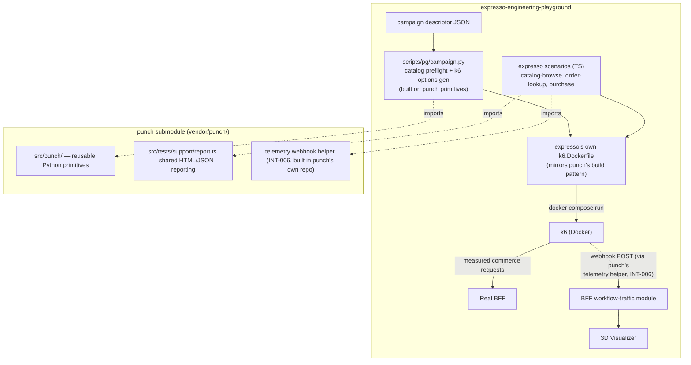

# Punch Submodule Integration for Performance Testing

Status: Proposed

> **Supersession note (2026-09-15):** This remains the historical integration
> record. The normalized YAML workflow design supersedes INT-002's planned
> private `_stream` import and its former host dependency boundary: Expresso
> core orchestration remains standard-library-only, while `./dev perf:*`
> explicitly installs `vendor/punch/requirements.txt` and consumes Punch's
> public workflow APIs. No historical requirement below is silently rewritten.

Related specifications:
[`live-workflow-traffic-and-falling-cups.md`](live-workflow-traffic-and-falling-cups.md)
(this document supersedes that spec's RUN-001, RUN-003, and RUN-004 as far
as *where* campaign orchestration and scenario code live — the runtime
behavior those sections describe is unchanged, only their ownership and
file locations move).

Cross-repo dependency: this spec has one requirement (INT-006) whose
implementation lives in the `punch` repository
(`https://github.com/nicopizar00/punch.git`), not here. This document
specifies the *contract* that dependency must satisfy; building it is
tracked in Punch's own repo.

## Purpose

Performance-testing capability — k6 scenarios, load-generation logic, and
the orchestration mechanics that drive them — is owned by `punch`, a
general-purpose, multi-consumer project maintained separately from this
repo. This repo's own scope is the web app, web services (BFF), and the
3D visualizer. This spec brings this repo into compliance with that
boundary: `punch` is added as a git submodule, this repo's k6 scenarios
stop being duplicated/reinvented and instead reuse `punch`'s shared
primitives, and the parts of the current performance layer that are
genuinely expresso-specific (catalog-driven scenario content, the
workflow-traffic telemetry bridge) are clearly separated from the parts
that are generic and should lean on `punch`.

## Problem statement

This repo currently has two things that should not both exist:

1. A full local git-subtree copy of k6-ts-docker/Punch under
   `tests/performance/k6/` (per `tests/performance/k6/README.md`'s
   `.subtree-marker`), plus a hand-rolled Python orchestrator
   (`scripts/pg/perf.py`, `scripts/pg/campaign.py`) that reimplements
   subprocess streaming, Docker Compose invocation, and report-path
   handling — mechanics `punch`'s own `src/punch/__main__.py` already
   implements as reusable patterns.
2. A separate, actively-maintained `punch` repository that is the actual
   source of truth for this capability, with its own more mature
   execution chain (TypeScript → esbuild → k6 image), shared reporting
   helpers (`src/tests/support/report.ts`), and its own orchestrator
   conventions (`docs/architecture/punch-boundaries.md`).

Inspection of `punch`'s current code (2026-09-07) found it is **not**,
today, a "point me at your compose file and scenarios" generic engine:
`src/punch/__main__.py` hardcodes its own `TESTS` dict, its own
`docker-compose.yml`, and log collection for its own four reference
services; `docker/k6.Dockerfile` hardcodes `COPY src/tests/` to its own
scenario directory. Even its one external-target scenario
(`bff-checkout-journey`, gated behind `TARGET_BASE_URL`) runs a *bundled*
script against a generic, loosely-thresholded e-commerce contract
(`http_req_failed: rate<0.60`, `checks: rate>0.20`) that the punch
maintainer(s) confirmed is meant as convenience self-validation against
Punch's own mock services, not a scenario for a specific consumer to
adopt as-is. This spec does not depend on `punch` changing that; it treats
`punch` as a source of *reusable primitives and one new generic feature*
(INT-006), not as a drop-in replacement for this repo's orchestrator.

## Requirement language

`MUST` identifies behavior required for this integration to be considered
complete. `SHOULD` identifies preferred behavior unless a documented
constraint prevents it. `MAY` identifies optional behavior.

## Definitions

- **Submodule**: the `punch` git repository, vendored into this repo via
  `git submodule`, pinned to a specific commit.
- **Reusable primitive**: a `punch`-authored Python function or TypeScript
  module usable by this repo's own orchestration/scenario code without
  modification — e.g. `punch`'s subprocess-streaming pattern, its
  evidence-file (`reports/state/punch-run.json`-style) convention, or
  `src/tests/support/report.ts`'s `buildHtml`/`buildSummaryJson`.
- **Expresso scenario**: a k6 test file whose HTTP contract targets this
  repo's own BFF. Authored and owned here — `punch` is explicitly not the
  right home for it, since `punch` serves multiple consumers and this
  contract is specific to this repo.
- **Telemetry webhook**: a generic, domain-agnostic lifecycle-event
  reporter this spec asks `punch` to add (INT-006), configured via a URL
  env var so any consumer — including this repo's `/workflow-traffic/events`
  — can receive events without `punch` knowing about that consumer.

## Architecture

`punch` never gains expresso-specific code. Everything expresso-specific
(catalog semantics, the BFF's actual contract, the workflow-traffic event
shape) stays in this repo and configures/calls `punch`'s generic pieces.

## INT-001: Submodule integration

### Requirements

- `punch` MUST be added as a git submodule at `vendor/punch/`, pinned to
  an explicit commit SHA (not tracking a branch).
- `README.md` and `docs/cli-reference.md` MUST document the onboarding
  step this adds: `git submodule update --init --recursive` after clone
  (or `git clone --recurse-submodules`).
- `./dev doctor` (or the nearest existing host-prerequisite check) SHOULD
  warn if `vendor/punch/` is present but empty (submodule not
  initialized), rather than failing opaquely later.
- Upgrading the pinned commit MUST be a deliberate, reviewable change (a
  one-line `git -C vendor/punch fetch && git -C vendor/punch checkout
  <new-sha>` followed by committing the updated gitlink), never automatic.

### Acceptance criteria

- A fresh clone followed by the documented submodule step produces a
  working `vendor/punch/` checkout at the pinned commit.
- `git status` on a fresh, correctly-initialized checkout shows no
  submodule drift.

## INT-002: Reusable Python primitives adoption

### Requirements

- Both `scripts/pg/campaign.py`'s and `scripts/pg/perf.py`'s
  Docker-invocation and evidence-reporting code (the latter backs
  `smoke`/`checkout-flow`/`read-heavy`, migrated by INT-004) MUST be
  rebuilt to reuse `punch`'s subprocess-streaming pattern (`_stream` in
  `vendor/punch/src/punch/__main__.py`) and evidence-file convention,
  imported from the submodule path, rather than maintaining
  separately-written equivalents. The two files MAY share a single
  internal helper module in `scripts/pg/` that wraps the imported `punch`
  primitive once, instead of each importing it independently.
- Catalog-specific logic that has no equivalent in `punch` — preflight
  validation against `use-cases/catalog.json`, concurrency-limit
  enforcement, k6 `options.scenarios` generation from a campaign
  descriptor — MUST remain entirely in this repo. `punch` has no concept
  of a use-case catalog and this spec does not ask it to gain one.
- The stdlib-only constraint (this repo's existing invariant) MUST
  continue to hold; `punch`'s `src/punch/` package is itself stdlib-only,
  so importing from it does not introduce a new dependency class.

### Acceptance criteria

- Neither `scripts/pg/campaign.py` nor `scripts/pg/perf.py` contains a
  re-implementation of logic that `vendor/punch/src/punch/` already
  provides.
- `pnpm pg:test` continues to pass with no new third-party imports.

## INT-003: Shared TypeScript reporting adoption

### Requirements

- Expresso scenarios MUST import `buildHtml`/`buildSummaryJson` from
  `vendor/punch/src/tests/support/report.ts` for their `handleSummary`
  output, instead of hand-writing report formatting.
- This requires expresso's k6 scenario source to be TypeScript (matching
  `punch`'s own scenarios), not the plain JavaScript the current
  `tests/performance/k6/scenarios/` files use — a relative import into a
  `.ts` support module is the natural mechanism; maintaining a parallel
  JS-only copy of the same helpers is the duplication this spec exists to
  remove.

### Acceptance criteria

- Every expresso scenario's `handleSummary` output is visually and
  structurally consistent with `punch`'s own HTML/JSON report shape.
- No expresso scenario file reimplements HTML report generation.

## INT-004: Full scenario migration

### Requirements

- ALL current k6 usage MUST migrate to the pattern this spec defines, not
  only the campaign runner: `smoke`, `checkout-flow`, `read-heavy`
  (currently `tests/performance/k6/scenarios/{smoke,checkout-flow,read-heavy}/`)
  and the three campaign adapters (`catalog-browse`, `order-lookup`,
  `purchase`) all become expresso-owned TypeScript scenarios following
  INT-003's convention.
- Each migrated scenario MUST preserve its existing behavior and
  thresholds exactly (this is a relocation/re-authoring, not a scenario
  redesign) unless a specific behavior change is separately justified.
- `report-event.js`'s fire-and-forget POST becomes a call into `punch`'s
  telemetry webhook helper (INT-006) once that exists; until then, per
  INT-006's phased delivery note, it MAY remain the current bespoke
  implementation as an interim measure — this spec MUST NOT block on
  INT-006 landing before the rest of the migration proceeds.

### Acceptance criteria

- `tests/performance/k6/scenarios/` (the old plain-JS subtree layout) is
  fully replaced; nothing under the old layout is dual-maintained
  alongside its TypeScript replacement.
- `./dev perf:smoke`, `./dev perf:checkout-flow`, `./dev perf:read-heavy`,
  and `./dev perf:campaign` all continue to work, targeting the migrated
  scenarios.

## INT-005: Execution chain (build step)

### Requirements

- This repo MUST gain its own small `k6.Dockerfile` mirroring `punch`'s
  exact build pattern (`node:lts-alpine` esbuild builder stage → copy
  `dist/` into a `grafana/k6` image stage), rather than requesting a
  parameterized version of `punch`'s own Dockerfile. Rationale: `punch`'s
  `docker/k6.Dockerfile` hardcodes `COPY src/tests/` to its own directory;
  adding a build-arg for an external scenario path is a `punch`-side
  change this spec does not require, and a ~10-line repo-owned Dockerfile
  is simpler than coordinating that cross-repo change.
- The build context for this repo's `k6.Dockerfile` MUST include both this
  repo's own scenario source directory and `vendor/punch/src/tests/support/`
  (so the `support/report.ts` import in INT-003 resolves during the
  esbuild step).
- `infra/docker/compose.performance.yaml`'s `k6` service MUST build from
  this new Dockerfile instead of pulling the bare `grafana/k6` image
  directly, since scenarios are now TypeScript requiring a build step.

### Acceptance criteria

- `docker compose -f infra/docker/compose.performance.yaml build k6`
  succeeds from a fresh checkout with the submodule initialized.
- The built image's `/scripts/` contents are the compiled output of this
  repo's own scenario sources, not `punch`'s.

## INT-006: Generic telemetry webhook (built in `punch`, not here)

This requirement's implementation is out of this repo's scope. It is
specified here so this repo's delivery sequence can reference a concrete
contract when it lands, and so the dependency is explicit rather than
implicit.

### Requirements (of the `punch`-side feature)

- `punch` MUST add a configurable-URL lifecycle-telemetry reporter: a
  small, domain-agnostic helper that POSTs one event to a URL read from an
  environment variable (naming TBD by `punch`'s own maintainers — this
  spec suggests `TELEMETRY_WEBHOOK_URL` as a starting proposal only).
- The event shape MUST be generic enough for an arbitrary consumer to map
  their own semantics onto it — at minimum a run/test identifier, a
  timestamp, and an outcome/status field — without assuming any
  consumer's specific domain (no expresso-specific field names).
- The helper MUST be fire-and-forget: a failed or slow webhook call MUST
  NOT fail or slow the calling scenario's iteration, matching the same
  requirement this repo's current `report-event.js` already implements
  for its own endpoint.

### How this repo will use it once it exists

- Expresso's scenarios configure the webhook URL to point at
  `/workflow-traffic/events` and map `punch`'s generic event fields onto
  the shape that endpoint expects (`runId`, `useCaseId`, `useCaseVersion`,
  `iterationId`, `outcome`, `timestamp` — see
  `live-workflow-traffic-and-falling-cups.md`'s RUN-005). Any fields the
  generic shape doesn't cover are attached by the scenario at the call
  site, not by asking `punch` to grow expresso-specific knowledge.

## INT-007: Retire the local subtree

### Requirements

- `tests/performance/k6/`'s git-subtree-imported content and its
  `.subtree-marker`/ADR-0003 reference MUST be removed once INT-004's
  migration is complete — the submodule is the new source of shared
  logic, so maintaining both a subtree copy and a submodule of the same
  upstream is the exact duplication this spec exists to eliminate.
- `docs/performance/orchestrator.md` and `tests/performance/k6/README.md`
  (or their replacements at the new scenario location) MUST be updated to
  describe the submodule-based layout, with no remaining reference to the
  subtree strategy as current.

### Acceptance criteria

- No file under the old `tests/performance/k6/scenarios/` path remains
  after migration.
- `git log --follow` on any migrated scenario's new location shows a
  clean rename/replacement, not an orphaned old file left behind.

## Out of scope

- Any change to `punch`'s own reference application (`catalog-api`,
  `orders-api`, `gateway-api`) or its bundled self-test scenarios
  (`smoke`, `catalog-gate`, `order-journey`, `bff-checkout-journey`) —
  those remain Punch's own convenience self-validation, not something
  this repo repurposes or extends.
- Parameterizing `punch`'s own orchestrator (`src/punch/__main__.py`) or
  its `k6.Dockerfile` to accept an external compose file/scenario
  directory. INT-005 works around this with a repo-owned Dockerfile
  instead of requesting that `punch`-side change.
- Any change to the BFF `workflow-traffic` module or the Visualizer's
  falling-cup rendering — this spec only moves *where scenario code and
  orchestration mechanics live*, not the runtime contract already
  specified in `live-workflow-traffic-and-falling-cups.md`.
- Publishing `punch` itself, or any change to its adoption/governance
  tooling (`punch init`, the Copilot-skill-adoption scan) — unrelated to
  performance-testing capability.

## Delivery sequence

1. INT-001: add the submodule, document onboarding, confirm a fresh
   clone works.
2. INT-002: rebuild `scripts/pg/campaign.py`'s mechanics on `punch`
   primitives; re-run `pnpm pg:test`.
3. INT-005: add this repo's own `k6.Dockerfile` and wire
   `compose.performance.yaml` to build from it (can proceed in parallel
   with step 2 — independent files).
4. INT-003 + INT-004: migrate `smoke`, `checkout-flow`, `read-heavy`, and
   the three campaign adapters to TypeScript, importing `punch`'s shared
   report helpers. `report-event.js` stays as its current interim
   implementation at this point (INT-006 not yet available).
5. INT-007: remove the old subtree layout once step 4's replacements are
   verified working end-to-end (`./dev perf:smoke`, `./dev perf:campaign`,
   etc. all green against the new layout).
6. (Blocked on `punch`-side work, tracked separately) INT-006 lands in
   `punch`; a follow-up change in this repo swaps `report-event.js`'s
   interim implementation for a call into the new webhook helper and bumps
   the pinned submodule commit.
