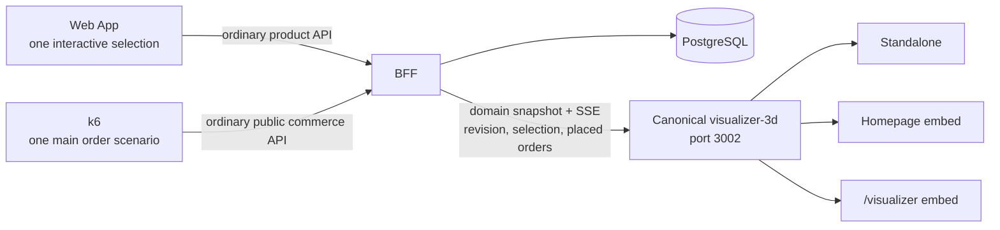

# Synchronized Single-Cup Order Visualizer and Live Order Rain

Status: Proposed

Related:

- [Real-Stack E2E Certification for Single-Cup Live Order Rain](live-traffic-visualizer-e2e-certification.md)
- [Punch Submodule Integration for Performance Testing](punch-submodule-integration.md)

This specification supersedes
`synchronized-order-visualizer-and-paid-order-rain.md`,
`live-workflow-traffic-and-falling-cups.md`, and the Visualizer requirements in
`executable-use-cases-and-live-traffic.md`.

## Purpose

Define one deliberately narrow commerce experience and one canonical 3D
representation of it:

1. The catalog contains exactly one orderable product, **Cup of Coffee**.
2. A user selects exactly one cup and then places the order anonymously.
3. While the interactive selection is open, one cup is the foreground hero in
   every Visualizer surface.
4. Successful order placement removes that foreground cup and emits exactly one
   background falling cup.
5. The rain layer is always connected and represents all live successfully
   placed orders, including orders produced by the one k6 scenario.
6. Standalone, homepage, and `/visualizer` use the same running Three.js
   renderer served on port `3002`.
7. The product stack and the performance-testing stack remain separate.

The design MAY preserve generic internal seams for future products. Its current
public behavior MUST remain strict; unused generality MUST NOT make additional
products, quantities, cart shapes, checkout paths, or Visualizer meanings
possible.

## Locked product decisions

- The only catalog product is named **Cup of Coffee**.
- Reusing the existing stable product identity (for example
  `prod_espresso`) is preferred over inventing a second product record.
- The only allowed quantity is `1`.
- The only allowed cart states are empty or one Cup of Coffee with quantity
  `1`.
- The user-visible flow is `idle -> selected -> order placed -> idle`.
- Once selected, the only normal product action is **Place Order**.
- A successfully persisted response from **Place Order** is the achieved-order
  boundary.
- There is no separate payment step, payment state, **Prepare Order** step, or
  fulfillment action in this E2E.
- The term “paid” in an older specification does not introduce another state.
  For this slice, successful order placement is the final business event.
- Checkout is anonymous. No customer, recipient, or other human name is
  required, collected, synthesized, or displayed.
- After success, the cart and interactive selection are cleared atomically and
  the user may repeat the same flow.
- The rain layer remains enabled whether or not a Web App user is active.
- With no newly placed orders, an always-on rain is healthy and idle; it MUST
  NOT fabricate cups.

## Requirement language

The words MUST, MUST NOT, SHOULD, SHOULD NOT, and MAY are normative.

## Definitions

- **Interactive selection**: the one Cup of Coffee explicitly selected by a
  user through the Web App. It is the only source of the foreground hero cup.
- **Placed order**: an order durably created by the successful Place Order
  operation.
- **Rain cup**: one background falling-cup animation correlated to one placed
  order.
- **Canonical renderer**: the HTML, JavaScript, assets, scene state machine,
  diagnostics, and Three.js runtime served by `visualizer-3d` on port `3002`.
- **Surface**: the standalone Visualizer, the homepage embed, or the
  `/visualizer` embed.
- **Semantic synchronization**: agreement on BFF revision, selection identity,
  placed-order identities, totals, and connection state. It excludes camera
  pose and frame-perfect animation.
- **Product stack**: Web App, BFF, database, and 3D Visualizer.
- **Performance stack**: k6 scenarios, Punch integration, runners, and reports.

## Architecture



There is no k6 lifecycle webhook, iteration feed, generic-request feed, or
performance-only endpoint between the performance stack and the product stack.
Both user and k6 orders become rain through the ordinary persisted order domain.

The foreground path is intentionally narrower. Generic cart requests cannot
prove that a Web App user is actively choosing a product because k6 performs
the same HTTP sequence. The Web App therefore publishes a small product
selection signal. It is a product interaction contract, not a k6 contract.

## Current implementation review

As reviewed on 2026-09-07, the running implementation is **not accurate** to
this product model.

What the existing “rain of cups” actually shows:

1. A k6 workflow executes a sequence of real HTTP requests.
2. The scenario emits a separate fire-and-forget lifecycle event for the
   workflow iteration.
3. The BFF accepts that event through `/workflow-traffic/events` and relays it
   through `/workflow-traffic-updates`.
4. The Visualizer creates a falling cup for that lifecycle event.

The cup therefore represents a k6 workflow iteration, not an individual HTTP
request and not a persisted order. Calling the commerce API outside that
telemetry path does not currently produce the same rain.

The reusable parts are partial:

- Web surfaces already embed/proxy the standalone Visualizer service rather
  than owning a complete React Three.js renderer.
- The BFF already publishes a revisioned domain snapshot/update path.
- The Visualizer already has a foreground-object concept and reusable coffee
  assets/falling-cup mechanics.

The current semantic behavior is wrong for the new goal:

- the seed/catalog exposes multiple products;
- the cart accepts multiple lines and quantities;
- checkout requires `customerName`;
- order preparation/fulfillment remains part of the existing flow;
- the foreground can be inferred from generic cart/order state, so k6 work can
  leak into it;
- rain is driven by workflow telemetry rather than placed-order identity;
- multiple k6 scenarios/adapters are supported; and
- the product runtime contains k6-specific ingest, transport, HUD, and event
  concepts.

## Prioritized implementation backlog

### P0 — establish the only valid domain outcome

1. Seed and expose only Cup of Coffee.
2. Enforce empty-or-one-cup, quantity-one state in the BFF, including
   concurrency and rejection of removal or replacement after selection.
3. Remove the name requirement and make anonymous Place Order the atomic,
   terminal action.
4. Define stable `orderId`/`placedAt`, recent-order, total, idempotency, and
   revision semantics.

These are first because the Visualizer cannot implement exactly-one rain from
an ambiguous or non-terminal domain event.

### P1 — synchronize and render the product semantics

1. Add the Web App interactive-selection signal and its BFF projection.
2. Make foreground rendering depend only on that signal.
3. Make the always-on rain consume only newly placed-order identities with
   replay/reconnect deduplication and bounded Three.js lifecycles.
4. Prove standalone, homepage, and `/visualizer` are the same port-3002
   renderer instance/build and converge on BFF revision.

### P1 — remove cross-system coupling

1. Remove or retire the BFF workflow-traffic ingest/SSE from the product
   runtime.
2. Remove iteration transport, counters, and cup creation from the Visualizer.
3. Reduce Expresso k6 to `single-cup-order`, one VU for the current cart
   constraint, and no product callback.
4. Keep all run/iteration metadata and reporting inside k6/Punch.

This work is the same priority as rendering because either old path remaining
would preserve two conflicting meanings for a falling cup.

### P2 — certify and stop

1. Add production-inert renderer diagnostics.
2. Implement the real-stack cases in the linked certification spec.
3. Verify strict invalid cases, anonymous completion, exactly-one rain,
   repeated orders, k6 separation, reconnect, and capacity bounds.
4. Stop when the certification passes; multiple products, payment,
   preparation, and additional scenarios require a future specification.

## CUP-001: Strict one-product catalog

### Requirements

- The public catalog MUST return exactly one active, orderable product.
- Its display name MUST be `Cup of Coffee`.
- The Web App MUST render exactly one selectable product.
- The Web App MUST NOT expose variants, quantity controls, multi-select,
  product comparison, or alternate catalog actions.
- The BFF MUST reject:
  - any other product identity;
  - quantity other than `1`;
  - a second line;
  - a second add while the cart is occupied;
  - updates that produce a state other than empty or exactly one allowed cup.
- Once the one cup is selected, the public product flow MUST reject removal,
  replacement, quantity change, and cart reset. Successful Place Order is the
  only normal operation that may clear that cup.
- UI constraints alone are insufficient. The domain/service layer MUST enforce
  the invariant transactionally.
- Existing generic repository structures MAY remain when that is the smallest,
  most maintainable implementation, but they MUST be unreachable as broader
  public behavior.

### Acceptance criteria

- `GET /products` returns one Cup of Coffee.
- Adding that product once results in one cart line with quantity `1`.
- Attempts to add twice, set quantity `0` or `2`, or use another product fail
  without changing the cart.
- A concurrent double-add cannot leave more than one cup selected.

## CUP-002: Strict anonymous Place Order flow

### Requirements

- An order MUST be placeable only from the valid one-cup cart state.
- The Place Order request MUST contain no customer, recipient, or other human
  name field. Such fields MUST be rejected rather than accepted or synthesized.
- The Web App MUST contain no name input, name validation, or generated guest
  name.
- An optional idempotency key MAY be accepted as metadata, preferably via the
  `Idempotency-Key` header. It is not customer identity.
- The BFF MUST reject Place Order when the cart is empty or invalid.
- On success, the BFF MUST atomically:
  1. persist one order containing one Cup of Coffee at quantity `1`;
  2. assign one immutable order identity and placement timestamp;
  3. clear the cart;
  4. close the correlated interactive selection, when present;
  5. advance the domain revision to represent the resulting committed state.
- The successful Place Order response is the only completion required by the
  E2E flow.
- Existing fulfillment endpoints or statuses MAY remain for compatibility, but
  they MUST NOT be required, invoked, or interpreted as completion by this
  product flow, the Visualizer, or the main k6 scenario.
- A failed or rolled-back Place Order MUST create neither an order identity nor
  a rain cup.

### Acceptance criteria

- A user can select the cup and place the order without entering a name.
- One success creates one order and returns the product to the initial empty
  state.
- Refreshing or retrying the same idempotent request cannot create a second
  order.
- No **Prepare Order** action is needed for the flow to pass.

## CUP-003: Interactive selection contract

### Requirements

- The BFF MUST expose a narrow semantic interaction contract for the Web App's
  current selection.
- The contract MUST represent only:

```ts
interface ActiveSelection {
  readonly selectionId: string;
  readonly productId: string;
  readonly quantity: 1;
  readonly state: "selected";
  readonly updatedAt: string;
}
```

- Selecting Cup of Coffee through the Web App MUST create or replace the one
  active selection and add the one allowed cart item as one logical user
  action.
- The Web App MUST not offer a normal transition from `selected` except Place
  Order.
- Checkout MUST correlate and close the Web App selection without relying on a
  customer name.
- Browser loss, failed transport, or process restart MAY use deterministic
  recovery cleanup. Such cleanup is technical recovery, not another
  user-visible completion path.
- Ordinary cart traffic without an interactive selection signal MUST NOT become
  a foreground cup. This is what prevents k6's in-progress carts from appearing.
- The contract MUST contain no k6 run, scenario, VU, iteration, or source-type
  field.

### Acceptance criteria

- A Web App selection is visible as one active selection in the BFF projection.
- An equivalent k6 cart request creates no active interactive selection.
- At most one active selection exists for the current product experience.
- Successful correlated order placement removes it.

## CUP-004: Canonical scene projection

### Requirements

- The BFF MUST publish one canonical Visualizer projection through a snapshot
  and its existing domain-state update transport.
- The projection MUST contain at least:

```ts
interface VisualizerProjection {
  readonly revision: number;
  readonly activeSelection: ActiveSelection | null;
  readonly recentPlacedOrders: readonly {
    readonly orderId: string;
    readonly placedAt: string;
  }[];
  readonly placedOrderTotal: number;
}
```

- `revision` MUST identify semantic BFF state, not an animation frame.
- `recentPlacedOrders` MUST be bounded, ordered deterministically, and preserve
  stable order identity across snapshots and reconnects.
- `placedOrderTotal` MUST include all successfully placed orders, including
  those outside the recent window and those placed by k6.
- The foreground hero MUST be derived only from `activeSelection`.
- Background rain MUST be derived only from newly observed placed-order
  identities.
- Products, carts, HTTP requests, workflow iterations, and fulfillment status
  transitions MUST NOT independently spawn cups.

### Acceptance criteria

- The same unchanged snapshot yields the same semantic state on all surfaces.
- Replaying a snapshot does not create duplicate rain cups.
- One committed order adds one identity and increments the total exactly once.

## CUP-005: Foreground hero behavior

### Requirements

- While `activeSelection` is non-null, the scene MUST display exactly one Cup
  of Coffee as the main foreground object.
- The hero cup MUST be visually distinguishable from background rain.
- All surfaces MUST converge on the same selection identity and BFF revision.
- After successful Place Order, that hero cup MUST disappear before or as the
  corresponding background rain cup is spawned.
- With no active selection, no persisted order, product fallback, cart item, or
  k6 activity may be promoted into the hero position.

### Acceptance criteria

- Selecting the product produces one hero cup on standalone, homepage, and
  `/visualizer`.
- A second hero cup cannot be produced.
- A k6 iteration never produces a hero cup.
- Placing the order returns all surfaces to no-selection foreground state.

## CUP-006: Always-on placed-order rain

### Requirements

- The background rain layer and its domain subscription MUST start with the
  scene and remain enabled regardless of Web App activity.
- Every newly observed placed order MUST produce exactly one rain cup per
  connected surface.
- Rain cup identity MUST be correlated by immutable `orderId` and `placedAt`.
- Orders from the Web App, k6, or another ordinary API client MUST receive
  identical rain treatment.
- Intermediate catalog, cart, checkout-attempt, health, and generic HTTP
  requests MUST produce zero cups.
- A k6 iteration is not a visual identity. Only its final successfully placed
  order can produce a cup.
- Snapshot replay, SSE retry, duplicate delivery, and reconnect MUST be
  deduplicated within the page session.
- Active Three.js rain objects and queued animations MUST be bounded. Completed
  animation objects MAY be recycled or removed; historical truth remains in
  `placedOrderTotal`.
- Under the declared supported order rate, order identities MUST NOT be sampled
  or silently dropped. Playback MAY queue or coalesce timing, but one order
  remains one observable rain event.
- No pause, resume, or clear control may disable the canonical live rain.

### Acceptance criteria

- With zero traffic, the rain connection is healthy, the layer is enabled, and
  no synthetic cup falls.
- One successful order produces exactly one cup.
- Ten successful orders produce ten correlated rain events, subject to bounded
  animation scheduling.
- Reconnect and replay do not increase the count for already seen identities.

## CUP-007: One renderer on all surfaces

### Requirements

- `apps/visualizer-3d` MUST own the canonical Three.js renderer.
- The standalone URL on port `3002` MUST serve that renderer.
- Homepage and `/visualizer` MUST embed or proxy that same running service.
- The Web App MUST NOT maintain a second Three.js scene implementation, copied
  scene state machine, or separate asset behavior.
- Each surface MUST expose a runtime build/instance identifier sufficient to
  prove which renderer served it.
- Synchronization MUST cover semantic projection and revision.
- Synchronization explicitly excludes camera control, render cadence, physics
  phase, and frame-perfect cup positions.

### Acceptance criteria

- All three surfaces report the same renderer build/instance identity.
- They converge on selection identity, placed-order total, recent identities,
  and revision.
- Independent cameras or animation timing do not constitute drift.

## CUP-008: Product/performance separation

### Requirements

- The Web App, BFF, database model, and Visualizer MUST NOT depend on k6 or
  Punch concepts.
- Product contracts MUST NOT contain run IDs, scenario names, VU IDs, iteration
  IDs, use-case IDs, k6 lifecycle states, or performance-webhook secrets.
- The BFF `/workflow-traffic/events` ingest and
  `/workflow-traffic-updates` SSE MUST be removed from the product runtime or
  made unreachable and non-normative before this feature is complete.
- The Visualizer MUST remove its default workflow-traffic transport, HUD
  counters, and iteration-driven cup creation.
- k6 MUST call only ordinary public product endpoints.
- k6/Punch reports MAY record performance metadata within the performance
  stack, but MUST NOT send it back into the product stack.
- The only convergence is a normal successfully persisted order.

### Acceptance criteria

- The product stack starts and passes its tests without k6/Punch installed or
  running.
- The performance scenario runs against the product stack without any
  telemetry callback URL.
- Searching product runtime contracts reveals no required k6 lifecycle fields.
- Disabling the performance stack has no effect on interactive Visualizer
  synchronization or its always-on subscription.

## CUP-009: One main k6 scenario

### Requirements

- The performance suite MUST expose exactly one supported Expresso scenario for
  now: `single-cup-order`.
- Each iteration MUST:
  1. resolve the one Cup of Coffee through the public catalog;
  2. add it once at quantity `1`;
  3. place the order anonymously;
  4. assert that the order was created.
- The scenario MUST NOT prepare, fulfill, cancel, or otherwise mutate the order
  after placement.
- The scenario MUST NOT publish lifecycle or workflow-traffic events.
- The scenario MUST NOT call the Web App interactive-selection contract.
- Until carts are isolated per actor, the supported scenario configuration MUST
  be one VU so the strict single-cart invariant remains deterministic.
- Other Expresso scenarios and adapters MUST be retired from the supported
  entry points. Reusable Punch primitives MAY remain.

### Acceptance criteria

- One VU and one iteration create exactly one order.
- The iteration creates no foreground selection and exactly one rain cup after
  Place Order.
- No intermediate request creates a cup.
- Reports describe the k6 run internally without requiring a product callback.

## CUP-010: Diagnostics and real-stack certification

### Requirements

- The canonical renderer MUST expose a read-only, production-inert diagnostics
  contract for automated proof.
- Diagnostics MUST report at least:
  - renderer build/instance identity;
  - transport state and last applied BFF revision;
  - active selection identity or `null`;
  - placed-order total and recent identities;
  - seen rain identities;
  - spawned, active, queued, completed, and dropped rain counts;
  - configured active-object and queue limits.
- Diagnostics MUST NOT mutate state, advance animation, fabricate events, or
  replace the real transport.
- Real-stack certification MUST cover the behavior in
  `live-traffic-visualizer-e2e-certification.md`.

### Acceptance criteria

- Tests can prove exactly-one semantics by identity, not screenshots alone.
- A failure report identifies the surface, revision, selection, order identity,
  transport state, and renderer instance.

## Compatibility and migration

- Prefer changing current seams over rewriting unrelated commerce code.
- Seed and catalog behavior MUST converge to the single product deterministically.
- Existing carts or seed data outside the invariant MUST be rejected or
  normalized by an explicit migration/cleanup policy before the strict flow is
  enabled.
- Legacy order name storage MAY be made nullable or removed. It MUST NOT force
  the UI or API to request or generate a name.
- Existing fulfillment data MAY remain stored, but it is outside this E2E and
  cannot drive the Visualizer.
- Deploy the order projection and renderer compatibility before removing an old
  transport when a rolling deployment requires a compatibility window. The
  completed state MUST contain no active workflow-traffic dependency.

## Non-goals

- Multiple products, quantities, variants, or carts.
- Customer identity or recipient-name collection.
- Payment-provider integration or a separate paid state.
- Barista preparation or fulfillment certification.
- Visualizing generic HTTP requests or k6 iterations.
- Making camera and physics frames identical between surfaces.
- Keeping one permanent Three.js object for every historical order.
- Rewriting generic internals solely to make them single-purpose.

## Delivery sequence

1. Enforce the one-product, one-line, quantity-one invariant in seed, catalog,
   cart, and UI.
2. Make Place Order anonymous and terminal; atomically clear the cart.
3. Add the narrow interactive-selection contract and correlate its closure to
   Place Order.
4. Extend the canonical BFF projection with revision, active selection, stable
   recent placed orders, and total.
5. Make the foreground hero depend only on interactive selection.
6. Replace workflow-iteration cups with always-on, deduplicated placed-order
   rain.
7. Prove that all Web surfaces use the port-3002 renderer.
8. Retire the product-side workflow-traffic path and reduce k6 to the one main
   scenario.
9. Run the real-stack certification and stop when its acceptance conditions
   pass.

## Definition of done

This specification is complete only when:

- the public catalog and BFF accept exactly one Cup of Coffee at quantity one;
- a user must select that cup before anonymous Place Order is available;
- Place Order is the terminal E2E action and no name or preparation is needed;
- one interactive selection is the only foreground hero on all three surfaces;
- its successful order removes the hero and creates exactly one rain cup;
- rain remains connected while idle and reflects every newly placed live order;
- k6 uses one main scenario, creates no foreground object, and its final order
  creates exactly one rain cup;
- the product stack has no required k6/workflow-traffic integration;
- surfaces share the port-3002 renderer and synchronize semantic BFF revision
  without requiring camera or frame-perfect equality; and
- the real-stack certification passes without mocks.
