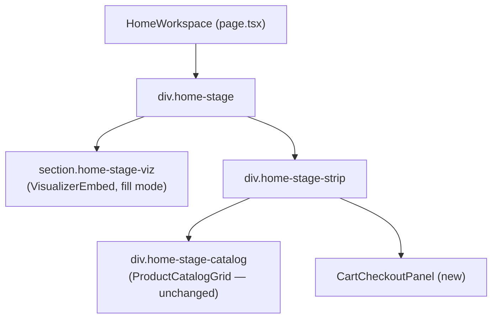

# Homepage Visualizer Stage — Design

Status: Proposed

Related:

- [CLAUDE.md](../../../CLAUDE.md) — "3D Visualizer (active feature)" section.
- [docs/architecture/web-entry-point.md](../../architecture/web-entry-point.md)
  — browser → web → visualizer proxy path (`/viz/*`). Unaffected by this
  document; the iframe still hits the same proxied URL.
- [docs/visualizer/art-direction.md](../../visualizer/art-direction.md) —
  embed mode (`iframe src` carrying `?embed=1`, HUD hidden via
  `body.embed`). Already used by the homepage today; reused unchanged here.

## Purpose

Today the homepage (`/`) is a catalog column next to a persistent 420px
visualizer rail rendered by `AppShell` (`shell-body` grid + `VisualizerPanel`,
sticky on desktop, a bottom pull-tab drawer under 1024px). Checkout lives on
its own route (`/checkout`), reached by opening the header cart icon's
slide-over drawer and clicking through.

This redesigns the homepage into a single fixed-viewport "stage": the 3D
visualizer becomes the largest, most prominent element on the page — not a
side panel that trails the content column — and the catalog + cart +
checkout all sit in that same first view, with no page scrolling. Every
other route keeps today's rail layout untouched.

## Non-goals

- **Every other route.** `/orders`, `/orders/[orderId]`, `/checkout` (as a
  standalone destination), `/cart`, `/dev`, `/performance` all keep the
  existing `shell-body` two-column grid + sticky `VisualizerPanel` rail +
  footer, exactly as they render today. Only `AppShell`'s branch for
  `pathname === "/"` changes.
- **Mobile/tablet layout for the new stage.** The request is browser-focused
  (desktop viewport). The current rail's responsive collapse (bottom
  drawer, pull-tab, `home-rail-sticky` mobile bar) is mobile-only machinery
  for the *rail* pattern and is being deleted along with the rail on `/`.
  No replacement responsive behavior is being designed for the stage layout
  — under roughly 1024px it will be visually tight and is an accepted
  limitation, not a bug to chase here.
- **Catalog pagination/virtualization.** The public catalog is contractually
  capped at exactly one product today (CUP-001, enforced in
  `apps/bff/prisma/seed.ts` and `CartService`); the homepage e2e fixture
  exercises up to two products as a generic-component smoke check. The
  catalog pane is sized for "a small handful," not for scale. If the real
  catalog ever grows meaningfully, the zero-scroll constraint on that pane
  will need revisiting — out of scope here.
- **`scene.js` / visualizer internals.** The scene already sizes off
  `stage.clientWidth`/`clientHeight` on every `resize` event
  (`apps/visualizer-3d/public/scene.js:35,47,109,122-124`) and recomputes
  `camera.aspect` from those values — a wide short container instead of a
  tall narrow one needs no scene-side changes.
- **`CartDrawer` / header cart icon.** Stay exactly as-is, globally,
  including on `/`. The new in-page panel is an addition, not a
  replacement — clicking the header cart icon on any page, including home,
  still opens the same slide-over.
- **Backend, `CUP-001` invariant, `ProductCatalogGrid`/`ProductCard`
  internals.** Reused as-is, only relocated in the layout.
- **Fixing the already-stale e2e specs.** `homepage-workspace.spec.ts`,
  `visual-integrity.spec.ts`, and `frontend-certification.spec.ts` were
  mid-edit for the *previous* rail-on-homepage layout. They need another
  pass once this ships (see Testing). That pass is follow-up work, not a
  blocker for this design.

## Architecture

### AppShell: route-conditional layout

`AppShell` (`apps/web/src/components/system/AppShell.tsx`) gains
`const isHome = pathname === "/"` and branches the body + footer:

```tsx
<div className="shell-body-wrapper">
  {isHome ? (
    <main className="shell-content-full">{children}</main>
  ) : (
    <div className="shell-body">
      <main className="shell-content">{children}</main>
      <VisualizerPanel />
    </div>
  )}
</div>

{!isHome && <footer>…</footer>}
```

Everything above the body (demo-mode banner, header, nav, cart drawer) is
unaffected and stays common to every route.

### Home page: three-zone grid, zero scroll

```
┌───────────────────────── header (unchanged) ─────────────────────────┐
│ logo · nav links · demo toggle · health · cart icon                  │
├────────────────────────────────────────────────────────────────────── ┤
│                                                                        │
│                     3D VISUALIZER — the stage                        │
│                     full width, ~60% of remaining height             │
│                                                                        │
├───────────────────────────────────────────────────┬──────────────────┤
│  CATALOG (ProductCatalogGrid, unchanged component) │  CartCheckout    │
│  ~40% of remaining height, majority width          │  Panel (new)     │
│                                                     │  380px sidebar   │
└───────────────────────────────────────────────────┴──────────────────┘
```

`apps/web/app/page.tsx` root becomes a grid that fills the flex remainder
under the header — the same `flex: 1 1 auto; min-height: 0` technique
`.shell-body` already uses, so no hardcoded `vh` math and no dependency on
whether the demo-mode banner is showing:

```css
.home-stage {
  flex: 1 1 auto;
  min-height: 0;
  display: grid;
  grid-template-rows: minmax(0, 3fr) minmax(0, 2fr);
  width: 100%; /* full-bleed: this page does not use .container's 1200px cap */
}
.home-stage-strip {
  display: grid;
  grid-template-columns: minmax(0, 1fr) 380px;
  min-height: 0;
}
```

Component tree:



Dropping `.container`'s 1200px max-width on this page only is deliberate:
the stage is meant to use the actual browser window, not a centered column.
Header and footer elsewhere keep `.container` unchanged.

### New component: `CartCheckoutPanel`

`apps/web/src/components/cart/CartCheckoutPanel.tsx`. Right column of the
strip; combines what `InlineCartSummary` and `/checkout`'s summary card +
submit button do today into one always-visible panel:

- Reads `useCart()` (existing `CartProvider` context — no new state layer).
- Empty state: compact inline message ("Cart is empty — add a product to
  get started"), not the illustrated `EmptyState` component used on the
  full `/cart` and `/checkout` pages — that component is sized for a full
  page, not a fixed sidebar slice.
- Non-empty state: item rows (name, qty, line total — same fields as
  `CartDrawer`'s `CartItemRow`, no qty/remove controls per CUP-001), total,
  a "Place Order" button.
- Submit: `expressoApi.checkout({})` → on success, `router.push` to
  `/orders/:orderId`; on failure, inline error text (same 400/409/generic
  branching `CheckoutPage` has today).
- No props — it's a self-contained panel, same pattern as `CartDrawer`.

### `/checkout` route becomes a thin wrapper

`apps/web/app/checkout/page.tsx` renders `CartCheckoutPanel` full-page
(centered, with the loading/empty full-page states it already has) instead
of duplicating the item-list/submit logic inline. This keeps direct links
and bookmarks to `/checkout` working, and gives the panel exactly one
implementation instead of two copies of the same submit/error handling.

### `VisualizerEmbed`: add a `fill` mode

`apps/web/src/components/visualizer/VisualizerEmbed.tsx` currently sizes
its iframe wrapper via a fixed CSS `aspect-ratio` (`aspectRatio` prop). The
stage needs to fill its grid row's actual height instead of holding a
fixed ratio. Add a `fill?: boolean` prop: when true, the wrapper gets
`height: 100%` instead of `aspect-ratio`. Existing call sites
(`VisualizerPanel`'s rail usage, the standalone-page usage before it was
deleted) keep passing `aspectRatio` and are unaffected — this is an
additive prop, not a signature change.

### CSS changes (`globals.css`)

Added: `.home-stage`, `.home-stage-viz`, `.home-stage-strip`,
`.home-stage-catalog`, and whatever `CartCheckoutPanel` needs.

Removed (home-page-only rules; the same class names' rail-page counterparts
survive because the rail itself survives on every other route): the
`home-workspace`/`home-rail-sticky` block's *mobile* portions
(`globals.css:1078-1096`) — the sticky bottom cart bar and the `min-width:
1024px` media query hiding it, since `/` no longer has a rail to be an
alternative to. The `.viz-panel`/`.viz-pull-tab`/`.viz-bezel` rules
(`globals.css:1147-1238`) are untouched — `VisualizerPanel` still renders
them on every non-home route.

## Data flow: a full in-page purchase

1. Shopper lands on `/`. `AppShell` sees `isHome`, renders the stage layout
   with no rail. `VisualizerEmbed` mounts once, `fill` mode, iframe
   `src="/viz/index.html?embed=1"` — identical embed contract to today.
2. Catalog pane (bottom-left) shows the product(s) via the existing
   `useSWR` fetch in `page.tsx` → `ProductCatalogGrid` → `ProductCard`,
   unchanged.
3. Shopper clicks "Add to cart" on a `ProductCard`. `useCart().addItem`
   (existing `CartProvider`) posts to the BFF; `CartCheckoutPanel`
   (bottom-right), subscribed to the same context, re-renders with the new
   item — no page navigation, no scroll, both panes stay on screen.
4. The visualizer stage reacts the same way it does today (SSE push from
   the BFF's `/visualization-updates`) — this document does not touch that
   path.
5. Shopper clicks "Place Order" in `CartCheckoutPanel`. On success, redirect
   to `/orders/:orderId` (a real navigation, leaving the stage — this is
   the existing post-checkout behavior, unchanged).

## Error handling

- **Iframe load error inside the stage:** `VisualizerEmbed`'s existing
  `error` state (12s load timeout → actionable retry UI) renders the same
  way in `fill` mode as it does in the rail — it's an absolutely
  positioned overlay on the wrapper regardless of the wrapper's sizing
  mode.
- **Empty cart in `CartCheckoutPanel`:** handled state (see Architecture),
  not an error — matches how `CartDrawer` treats an empty cart today.
- **Checkout submit failure (400/409/network):** same branching
  `CheckoutPage` already has, moved into the shared panel; both `/` and
  `/checkout` get identical error copy since they render the same
  component.
- **Demo-mode banner active:** the banner adds height above `.home-stage`;
  because the stage sizes off the flex remainder (`flex: 1 1 auto;
  min-height: 0`) rather than a hardcoded `100vh`-derived value, the
  3fr/2fr split just shrinks proportionally — zero scroll holds regardless
  of whether the banner is showing.
- **Very short browser viewport (e.g. a laptop window with devtools open):**
  no minimum-height safeguard or media-query fallback is built. Content can
  get uncomfortably small before anything would scroll or reflow. Accepted
  limitation per the browser-only, no-mobile-fallback scope — not chased
  here.
- **Out-of-stock product:** existing `ProductCard` disabled-button state,
  untouched by this document.

## Testing

No component-level unit tests exist for `apps/web` today (no Vitest config
under `apps/web`; coverage is Playwright e2e only) — this document doesn't
introduce a new testing layer, it follows the existing one.

- **Manual browser verification (required before calling this done, per
  the repo's UI-change rule):** run `./dev up web`, load `/`, confirm no
  page-level scrollbar at a normal desktop viewport, add the product,
  confirm the cart panel updates live without navigation, place an order,
  confirm redirect to `/orders/:id`. Also load `/orders` and `/dev` to
  confirm the untouched rail layout still renders correctly there.
- **e2e follow-up (tracked, not blocking this design):**
  `homepage-workspace.spec.ts`'s "renders catalog and embedded visualizer
  side by side" test asserts `railBox.x > catalogBox.x + 200` — exactly the
  side-by-side rail geometry this document removes from `/`; it needs
  rewriting to assert the new stage/strip geometry instead. Its "tablet"
  and "mobile" `describe` blocks assume the rail's responsive collapse,
  which no longer exists on `/` — they need to either move to a spec that
  exercises a non-home route (where the rail still lives) or be deleted if
  nothing home-specific remains to assert at those viewports. The "header
  cart button still opens the drawer" test needs no change. `visual-
  integrity.spec.ts` and `frontend-certification.spec.ts` need the same
  kind of pass — done during implementation, not during this brainstorm.

## Definition of done

- `/` renders catalog, live cart/checkout, and the 3D visualizer
  simultaneously in one viewport at a normal desktop browser size, with no
  page-level scrollbar.
- The visualizer on `/` is the largest single element on the page and is
  never hidden or collapsed behind a toggle/drawer.
- Adding a product and placing an order both complete without leaving `/`
  (except the existing, intentional post-checkout redirect to the order
  page).
- `/orders`, `/checkout` (direct visit), `/cart`, `/dev`, `/performance`
  are visually unchanged — still the sticky rail layout.
- `pnpm typecheck` and `pnpm lint` are green for `apps/web`.
